# 第2章 排序

## 2.1 冒泡排序

重复地走访过要排序的元素，依次比较两个相邻的元素，如果他们的顺序错误就把他们交换过来。走访元素的工作是重复地进行直到没有相邻元素需要交换，也就是说该元素列已经排序完成。

算法的名字由来是因为越大的元素会经由交换慢慢“浮”到数列的顶端（升序或降序排列），就如同碳酸饮料中二氧化碳的气泡最终会上浮到顶端一样，故名“冒泡排序”。

冒泡排序是一种稳定排序算法。

- 时间复杂度 $$O(N^2)$$

- 冒泡排序示例

```
[2   4   3   1   6   5]       【初始状态】
------------------------------------------------
[2   4   3   1   6   5]       【第一次冒泡开始】
  \__/
[2   4   3   1   6   5]
      \__/
[2   3   4   1   6   5]
          \__/
[2   3   1   4   6   5]
              \__/
[2   3   1   4   6   5]
                  \__/
[2   3   1   4   5] [6]       【第一次冒泡结束】
------------------------------------------------
[2   1   3   4] [5   6]       【第二次冒泡】
[1   2   3] [4   5   6]       【第三次冒泡】
[1   2] [3   4   5   6]       【第四次冒泡】
[1   2   3   4   5   6]       【第五次冒泡】
```

- 冒泡排序示例代码

``` cpp
void bubble_sort(int arr[], int len) {
    for (int i=0; i<len-1; i++) {       
        for (int j=0; j<len-1-i; j++) { 
            if (arr[j] > arr[j+1]) {  
                swap(&arr[j], &arr[j]);
            }
        }
    }
}
```

## 2.2 选择排序

从待排序的数据元素中选出最小（或最大）的一个元素，存放在序列的起始位置，然后再从剩余的未排序元素中寻找到最小（大）元素，然后放到已排序的序列的末尾。以此类推，直到全部待排序的数据元素的个数为零。

选择排序是不稳定的排序方法。

- 时间复杂度 $$O(N^2)$$

- 选择排序示例

```
[2   4   3   1   6   5]       【初始状态】
------------------------------------------------
i min j
↓ ↓   ↓  
[2   4   3   1   6   5]       【第一次选择开始】

i min    j
↓ ↓      ↓
[2   4   3   1   6   5]

 i        min j
 ↓          ↓ ↓
[2   3   4   1   6   5]

 i          min  j
 ↓           ↓   ↓
[2   3   4   1   6   5]

 i          min      j
 ↓           ↓       ↓
[2   3   4   1   6   5]

 i          min      
 ↓           ↓       
[2   3   4   1   6   5]
 \__________/


[1] [3   4   2   6   5]       【第一次选择结束】
------------------------------------------------
[1   2] [4   3   6   5]       【第二次选择】
[1   2   3] [4   6   5]       【第三次选择】
[1   2   3   4] [6   5]       【第四次选择】
[1   2   3   4   5   6]       【第五次选择】
```

- 选择排序示例代码

``` cpp
void select_sort(int A[], int n) {
    int min;
    for(int i=0; i<n-1; i++) {
        min = i; 
        for(int j=i+1; j<n; j++) {
            if(A[min] > A[j]) {
                min = j;
            }
        }
        // 将最小值与到本次循环的首元素交换
        swap(&A[min], &A[i]);
    }
}
```

## 2.3 插入排序

插入排序的基本操作就是将一个数据插入到已经排好序的有序数据中，从而得到一个新的、个数加一的有序数据，直到全部插入完为止。插入排序算法适用于少量数据的排序。

插入排序是一种稳定排序算法。

- 时间复杂度 $$O(N^2)$$

- 插入排序示例

```
[2   4   3   1   6   5]       【初始状态】

[2] [4   3   1   6   5]
     │
     │
     ↓
[2   4] [3   1   6   5]       【第一次插入】
         │
     ┌───┘
     ↓
[2   3   4] [1   6   5]       【第二次插入】
             │
 ┌───────────┘
 ↓
[1   2   3   4] [6   5]       【第三次插入】
                 │
                 |
                 ↓
[1   2   3   4   6] [5]       【第四次插入】
                     │
                 ┌───┘
                 ↓
[1   2   3   4   5   6]       【第五次插入】
```

- 插入排序示例代码

``` cpp
void insert_sort(int arr[], int n) {
    int j, temp;
    for(int i=1; i<n; i++) {
        temp = arr[i];
        for(j=i; j>0 && arr[j-1]>temp; j--) {
            arr[j] = arr[j-1];
        }
        arr[j] = temp;
    }
}
```

## 2.4 希尔排序

希尔排序是插入排序的一种又称“缩小增量排序”，是直接插入排序算法的一种更高效的改进版本。希尔排序是把记录按下标的一定增量分组，对每组使用直接插入排序算法排序；随着增量逐渐减少，每组包含的关键词越来越多，当增量减至1时，整个文件恰被分成一组，算法便终止。

希尔排序是不稳定的排序方法。

- 时间复杂度 $$O(N^{1.3})$$

- 希尔排序示例

```
 0   1   2   3   4   5   6   7     
[5   7   8   3   1   2   4   6]       【初始状态】

------------------------------------------------------------

[5   7   8   3   1   2   4   6]       【第一次分组 增量为4】
 │   │   │   │   │   │   │   │
[5]  │   │   │  [1]  │   │   │     第1组
    [7]  │   │      [2]  │   │     第2组
        [8]  │          [4]  │     第3组
            [3]             [6]    第4组

[1   2   4   3   5   7   8   6]       【第一次分组插入排序完成后】
 │   │   │   │   │   │   │   │
[1]  │   │   │  [5]  │   │   │     第1组
    [2]  │   │      [7]  │   │     第2组
        [4]  │          [8]  │     第3组
            [3]             [6]    第4组
------------------------------------------------------------

[1   2   4   3   5   7   8   6]       【第二次分组 增量为2】
 │   │   │   │   │   │   │   │
[1]  │  [4]  │  [5]  |  [8]  │     第1组
    [2]     [3]     [7]     [6]    第2组

[1   2   4   3   5   6   8   7]       【第二次分组插入排序完成后】
 │   │   │   │   │   │   │   │
[1]  │  [4]  │  [5]  |  [8]  │     第1组
    [2]     [3]     [6]     [7]    第2组
------------------------------------------------------------

[1   2   4   3   5   6   8   7]       【第三次分组 增量为1】
 │   │   │   │   │   │   │   │
[1] [2] [4] [3] [5] [6] [8] [7]    第1组

[1   2   3   4   5   6   7   8]       【第三次分组插入排序完成后】
 │   │   │   │   │   │   │   │
[1] [2] [3] [4] [5] [6] [7] [8]    第1组
```

- 希尔排序示例代码

``` cpp
void shell_sort(int arr[], int n) {
    int i,j;
    for(int d=n/2; d>0; d/=2) {
        for(i=d; i<n; i++) {
            int temp = arr[i];
            for(j=i-d; j>=0 && temp<arr[j]; j-=d) {
                arr[j+d] = arr[j];
            }
            arr[j+d] = temp;
        }
    }
}
```

## 2.5 归并排序

归并排序是采用分治法的一个非常典型的应用。将已有序的子序列合并，得到完全有序的序列；即先使每个子序列有序，再使子序列段间有序。若将两个有序表合并成一个有序表，称为二路归并。

归并排序是一种稳定排序算法。

- 时间复杂度 $$O(N*log^N)$$

- 归并排序示例

```
          [8   4   5   7   1   3   6   2]       【初始状态】
                /                 \
       [8   4   5   7]       [1   3   6   2]        分
           /     \               /     \            解
     [8   4]     [5   7]   [1   3]     [6   2]
      /   \       /   \     /   \       /   \  
    [8]   [4]   [5]   [7] [1]   [3]   [6]   [2]   ------
      \   /       \   /     \   /       \   / 
     [4   8]     [5   7]   [1   3]     [2   6]
           \     /               \     /            合
       [4   5   7   8]       [1   2   3   6]        并
                \                 /
          [1   2   3   4   5   6   7   8]
```

- 归并排序示例代码

``` cpp
void merge(int arr[],int temp[], int start, int mid, int end) {
    int i=start, j=mid+1, k=start;
    while(i!=mid+1 && j!=end+1) {
        if(arr[i] > arr[j])  
            temp[k++] = arr[j++];
        else  
            temp[k++] = arr[i++];
    }
    while(i != mid+1)  
        temp[k++] = arr[i++];
    while(j != end+1)  
        temp[k++] = arr[j++];
    for(i=start; i<=end; i++)
        arr[i] = temp[i];
}
 
void merge_sort(int arr[], int temp[], int start, int end) {
    if(start >= end)
        return;

    int mid = start + (end-start) / 2; // 避免溢出
    merge_sort(arr, temp, start, mid);
    merge_sort(arr, temp, mid+1, end);
    merge(arr, temp, start, mid, end);
}

void merge_sort(int arr[], int len) {
    int * temp = (int *)malloc(sizeof(int) * len);
    merge_sort(arr, temp, 0, len-1);
    free(temp);
}
```

### 2.5.1 递归的时间复杂度

**master公式**
$$
T(N) = a * T(\frac{N}{b}) + O(N^d)
$$

- $$N$$ ： 数据样本量
- $$a$$ ： 子过程调用次数
- $$\frac{N}{b}$$ ： 子过程数据样本量
- $$O(N^d)$$ ： 除去递归之外的时间复杂度

$$
递归时间复杂度 = 
\begin{cases}  
	O(N^{log_b^a}) , &log_b^a>d \\
	O(N^{d}*{log^N}) , &log_b^a=d \\
	O(N^d) , &log_b^a<d
\end{cases}
$$


### 2.5.2 数组小和问题

> 在一个数组中，每一个数左边比当前数小的数累加起来，叫做这个数组的小和。求一个数组的小和。

例：[2, 3, 4, 1, 5] 小和为17。

- 2左边比其小的数：
- 3左边比其小的数：2
- 4左边比其小的数：2、 3
- 1左边比其小的数：
- 5左边比其小的数：2、 3、 4、 1

思路：求数组中每个数左侧比其小的所有数的和，等同于求每个数右侧比其大的数的数量乘以这个数的和进行累加。

### 2.5.3 逆序对问题

> 在一个数组中，左边的数如果比右边的数大，则两个数构成一个逆序对，请输出逆序对数量。

例：[2, 3, 4, 1, 5] 逆序对数量为3，逆序对分别为(2,1)、(3,1)、(4,1)。

### 2.5.4 瑞士轮问题

> 在双人对决的竞技性比赛，如乒乓球、羽毛球、国际象棋中，最常见的赛制是淘汰赛和循环赛。前者的特点是比赛场数少，每场都紧张刺激，但偶然性较高。后者的特点是较为公平，偶然性较低，但比赛过程往往十分冗长。
>
> 本题中介绍的瑞士轮赛制，因最早使用于1895年在瑞士举办的国际象棋比赛而得名。它可以看作是淘汰赛与循环赛的折衷，既保证了比赛的稳定性，又能使赛程不至于过长。
>
> $$2*N$$ 名编号为 $$1$$~$$2N$$ 的选手共进行 $$R$$ 轮比赛。每轮比赛开始前，以及所有比赛结束后，都会对选手进行一次排名。排名的依据是选手的总分。选手的总分为第一轮开始前的初始分数加上已参加过的所有比赛的得分和。总分相同的，约定编号较小的选手排名靠前。
>
> 每轮比赛的对阵安排与该轮比赛开始前的排名有关：第1名和第2名、第3名和第4名、……、第$$2K – 1$$名和第$$2K$$名、…… 、第$$2N – 1$$名和第$$2N$$名，各进行一场比赛。每场比赛胜者得1分，负者得0分。也就是说除了首轮以外，其它轮比赛的安排均不能事先确定，而是要取决于选手在之前比赛中的表现。
> 
> 现给定每个选手的初始分数及其实力值，试计算在 $$R$$ 轮比赛过后，排名第 $$Q$$ 的选手编号是多少。我们假设选手的实力值两两不同，且每场比赛中实力值较高的总能获胜。

例：根据下表3名选手实力值及初始分数，求取4轮对阵后排名第2的选手为：编号1选手

|选手编号 | [1] | [2] | [3] | [4] | |
|:----:|:----:|:----:|:----:|:----:|:----:|
|选手实力值 | 10 | 5 | 20 | 15 | |
|选手初始分(排名) | 7(1) | 6(3) | 6(4) | 7(2) | 对阵情况|
|第1轮对阵后| 7(2) | 6(4) | 7(3) | 8(1) |[1]-[4] &nbsp;&nbsp;&nbsp; [2]-[3]|
|第2轮对阵后| 7(3) | 6(4) | 8(2) | 9(1) |[4]-[1] &nbsp;&nbsp;&nbsp; [3]-[2]|
|第3轮对阵后| 8(3) | 6(4) | 9(1) | 9(2) |[4]-[3] &nbsp;&nbsp;&nbsp; [1]-[2]|
|第4轮对阵后| 9(2) | 6(4) | 10(1) | 9(3) |[3]-[4] &nbsp;&nbsp;&nbsp; [1]-[2]|

思路：首先根据初始分数排序，然后在每次对阵结束后分为胜者组和败者组，分组时保证先进行对阵的选手在前，后对阵的选手在后，这样既保证了胜者组和败者组两组先天有序，再进行归并排序的merge操作，准备下次对阵。时间复杂度：$$O(N*log^N +R*N)$$

## 2.6 快速排序

基本思想是：通过一趟排序将要排序的数据分割成独立的两部分，其中一部分的所有数据都比另外一部分的所有数据都要小，然后再按此方法对这两部分数据分别进行快速排序，整个排序过程可以递归进行，以此达到整个数据变成有序序列。

快速排序是不稳定的排序方法。

- 时间复杂度 $$O(N*log^N)$$

- 第一趟快速排序示例

```
 i                                  ←-- j
 ↓                                      ↓
[30   24   5   58   18   36   12   42   39]       【快速排序初始化】

-----------------------------------------------------------------

 i                            j
 ↓                            ↓
[30   24   5   58   18   36   12   42   39]       【交换元素】
  \___________________________/

-----------------------------------------------------------------

      i --→                   j
      ↓                       ↓
[12   24   5   58   18   36   30   42   39]       【交换元素后】

-----------------------------------------------------------------

               i              j
               ↓              ↓
[12   24   5   58   18   36   30   42   39]       【交换元素】
                \_____________/
-----------------------------------------------------------------

               i     ←-- j
               ↓         ↓
[12   24   5   30   18   36   58   42   39]       【交换元素后】

-----------------------------------------------------------------

               i    j
               ↓    ↓
[12   24   5   30   18   36   58   42   39]       【交换元素】
                \___/
                
-----------------------------------------------------------------

               ij
               ↓↓
[12   24   5   18   30   36   58   42   39]       【交换元素后】

-----------------------------------------------------------------

[12   24   5   18]  30  [36   58   42   39]       【第一趟快速排序结束】

```

- 快速排序示例代码

``` cpp
int partition(int arr[], int low, int high) {
    int i=low, j=high, pivot=arr[low];
    while(i<j) {
        while(i<j && arr[j]>pivot) // 从右向左扫描
            j--;
        
        if(i<j) {                  // arr[i]和arr[j]交换后，i右移一位
            swap(&arr[i], &arr[j]);
            i++;
        }
        
        while(i<j && arr[i]<=pivot)// 从左往右扫描
            i++;
        
        if(i<j) {                  // arr[i]和arr[j]交换后，j左移一位
            swap(&arr[i], &arr[j]);
            j--;
        }
    }
    // 返回最终划分完成后基准元素所在位置
    return i;
}

void quick_sort(int arr[], int low, int high) {
    int mid;
    if(low<high) {
        mid = partition(arr, low, high);// 进行分割操作并返回基准元素
        quick_sort(arr, low, mid-1);    // 左区间递归快速排序
        quick_sort(arr, mid+1, high);   // 右区间递归快速排序
    }
}

void quick_sort(int arr[], int n) {
    quick_sort(arr, 0, n-1);
}
```

### 2.6.1 分类问题

- 时间复杂度 $$O(N)$$

> 给定一个数组arr，和一个数num，请把小于等于num的数放在数组的左边，大于num的数放在数组的右边。

思路：指针p从-1位置开始，规划p左侧为小于num的数的区域，然后准备一个指针q指向下标0位置，如果q指向元素小于等于num，则q指向元素与p+1指向元素交换，p、q往后移动；如果q指向元素大于num，则q往后移动，直到q移出数组

### 2.6.2 荷兰国旗问题

- 时间复杂度 $$O(N)$$

> 给定一个数组arr，和一个数num，请把小于num的数放在数组的左边，等于num的数放在数组的中间，大于num的数放在数组的右边。

## 2.7 堆排序

堆排序是指利用堆这种数据结构所设计的一种排序算法。堆是一个近似完全二叉树的结构，并同时满足堆积的性质：即子结点的键值或索引总是小于（或者大于）它的父节点。

堆排序是不稳定的排序方法。

- 时间复杂度 $$O(N*log^N)$$

- 堆排序示例代码

``` cpp
void max_heapify(int arr[], int start, int end) {
    // 父节点下标和子节点下标
    int dad = start, son = dad * 2 + 1;
    while (son <= end) {         // 子节点在范围内
        if (son+1 <= end && arr[son] < arr[son+1]) // 选择最大的子节点
            son++;
        if (arr[dad] > arr[son]) // 父节点大于子节点跳出函数
            return;
        else {                   // 否则交换父子节点，并继续子节点和孙节点比较
            swap(&arr[dad], &arr[son]);
            dad = son;
            son = dad * 2 + 1;
        }
    }
}
 
void heap_sort(int arr[], int len) {
    // 最后一个非叶子节点为(len-2)/2
    for (int i=len/2-1; i>=0; i--)
        max_heapify(arr, i, len - 1);

    // 先将第一个元素和已排好元素前一位做交换，再重新调整，直到排序完毕
    for (int i=len-1; i>0; i--)  {
        swap(&arr[0], &arr[i]);
        max_heapify(arr, 0, i - 1);
    }
}
```

### 2.7.1 建堆方法：HeapInsert

假定事先不知道有多少个元素，通过不断往堆里面插入元素进行调整来构建堆。大致步骤如下：

1. 首先增加堆的长度，在最末尾的地方加入最新插入的元素。
2. 比较当前元素和它的父结点值，如果比父结点值大，则交换两个元素，否则返回。
3. 重复步骤2。

这种插入建堆的时间复杂度是 $$O(N*log^N)$$

- HeapInsert 建堆示例


<div  style="float:left; width:400px; margin:0 auto;">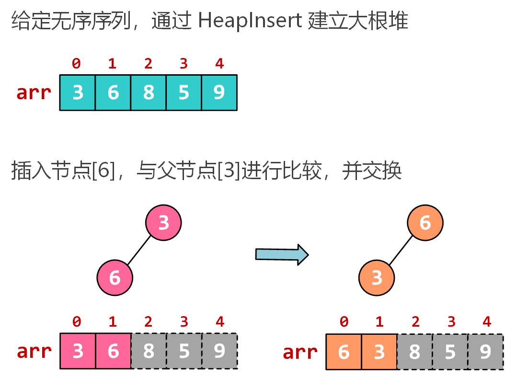</div>

<div  style="float:left; width:400px; margin:0 auto;">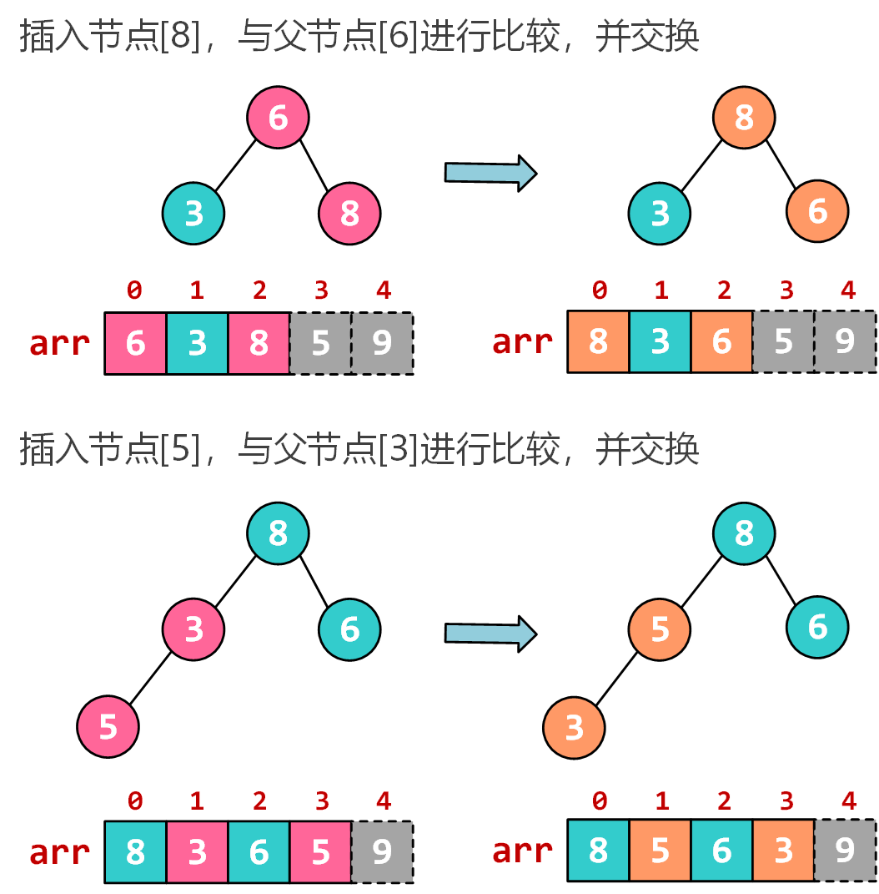</div>

<div  style="float:left; width:400px; margin:0 auto;">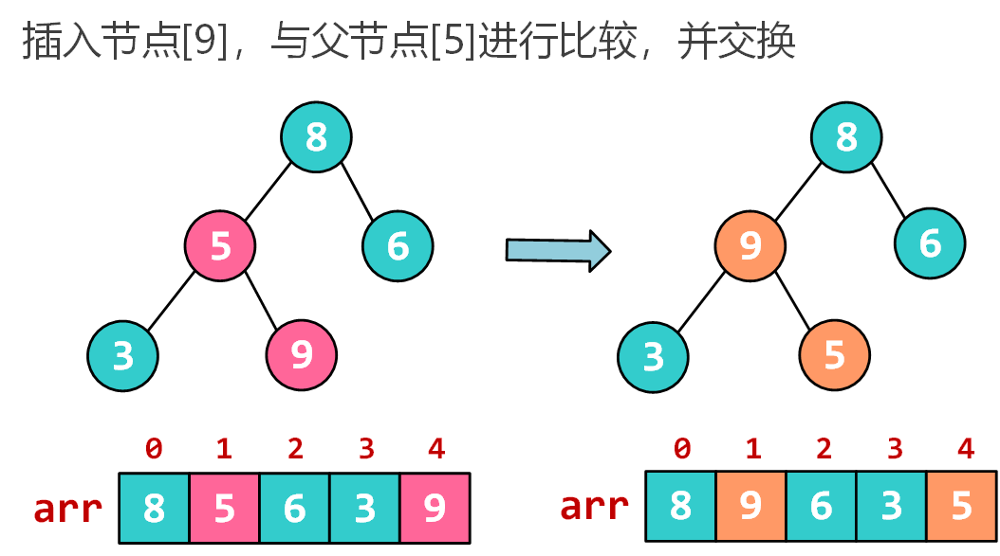</div>

<div  style="float:left; width:400px; margin:0 auto;">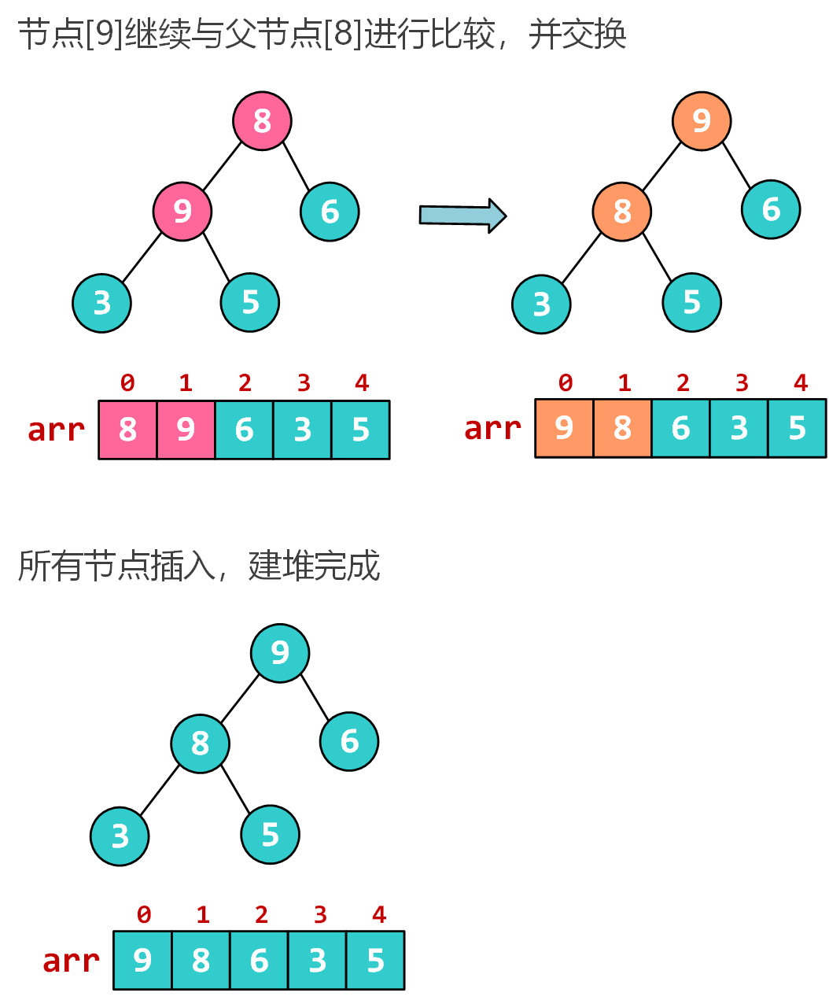</div>

<div style="width:100%; clear:both;" ></div>


### 2.7.2 建堆方法：Heapify

从最后一个非叶子节点一直到根结点进行堆化的调整。如果当前节点小于某个自己的孩子节点（大根堆中），那么当前节点和这个孩子交换，并持续往下递归调整。Heapify是一种类似下沉的操作，HeapInsert是一种类似上浮的操作。

这种建堆的时间复杂度是 $$O(N)$$

怎么找到第一个非叶子节点?

如果根节点在数组中的索引为0，那么第一个非叶子节点的计算公式为: $$last\_non\_leav = (arr.length - 2)/2$$

可以设最后一个非叶子节点位置为x，那么最后一个叶子节点一定是$$(2x+1)$$ 或者$$(2x+2)$$中的一个，然后可以建立方程求解。

- Heapify 建堆示例

<div  style="float:left; width:400px; margin:0 auto;">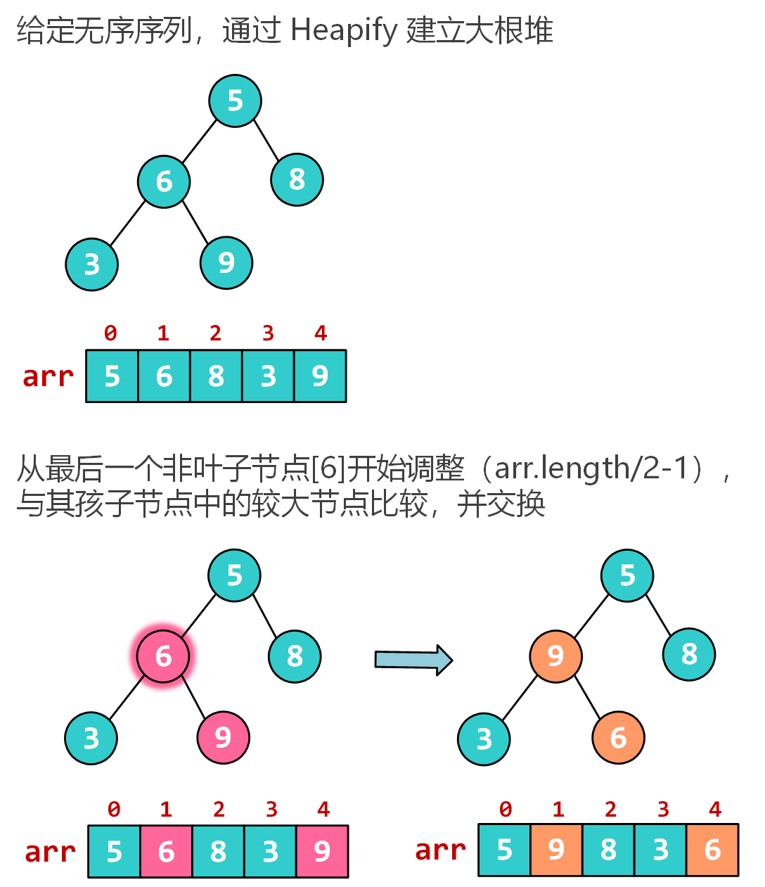</div>

<div  style="float:left; width:400px; margin:0 auto;">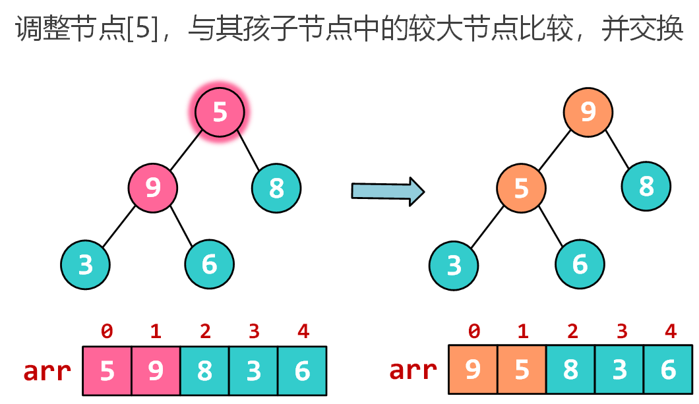</div>

<div  style="float:left; width:400px; margin:0 auto;"></div>

<div style="width:100%; clear:both;" ></div>

### 2.7.3 堆排序示例

将堆顶节点与末尾节点进行交换，使末尾节点最大。然后继续调整堆，再将堆顶节点与末尾节点交换，得到第二大节点。如此反复进行交换、重建、交换。

<div  style="float:left; width:400px; margin:0 auto;">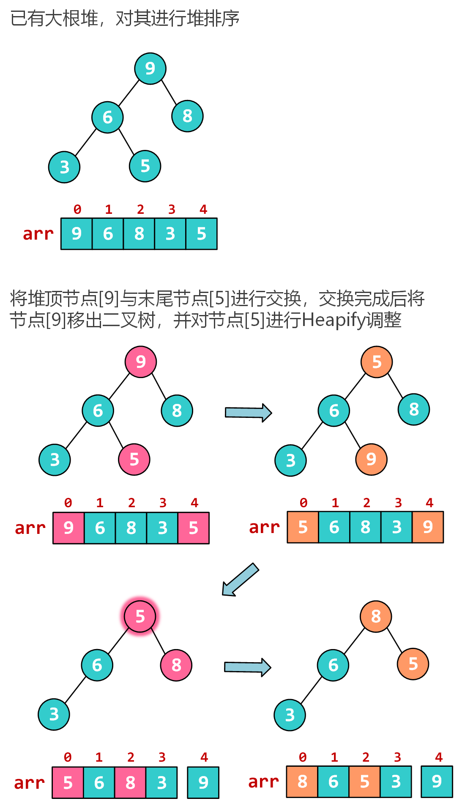</div>

<div  style="float:left; width:400px; margin:0 auto;">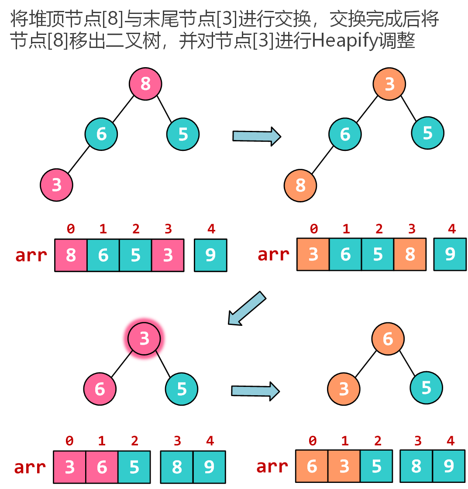</div>

<div  style="float:left; width:400px; margin:0 auto;">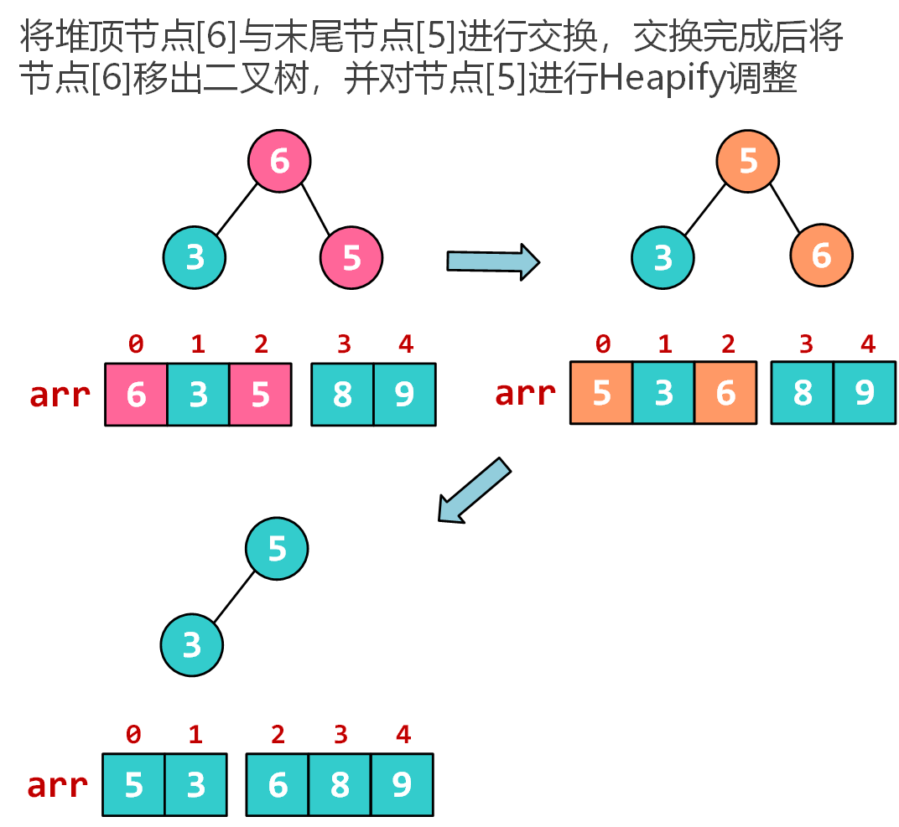</div>

<div  style="float:left; width:400px; margin:0 auto;">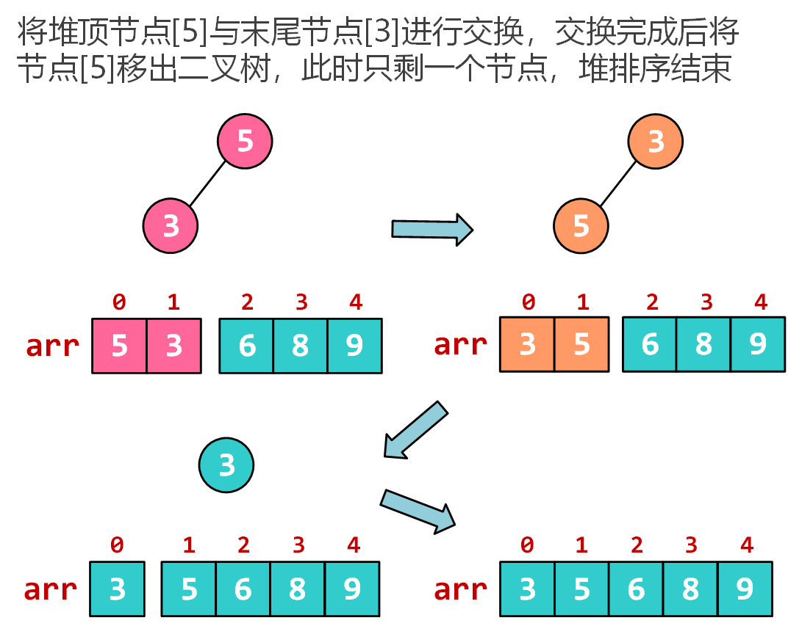</div>

<div style="width:100%; clear:both;" ></div>

## 2.8 桶排序

桶排序或所谓的箱排序，工作的原理是将数组分到有限数量的桶子里。每个桶子再个别排序（有可能再使用别的排序算法或是以递归方式继续使用桶排序进行排序）。

桶排序是一种稳定排序算法。

- 平均时间复杂度 $$O(N+C)$$，其中 $$C=N*(logN-logM)$$，$$N$$ 为待排数据，$$M$$为桶数量。当$$N=M$$时，最好效率达到 $$O(N)$$。

- 桶排序示例

<div  style="float:left; width:400px; margin:0 auto;">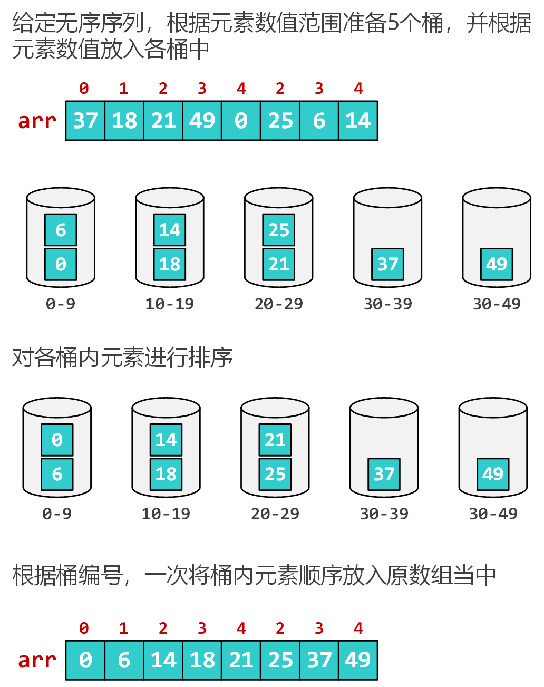</div>

<div style="width:100%; clear:both;" ></div>

- 桶排序示例代码

``` cpp
#include <iostream>
#include <vector>
#include <algorithm>
using namespace std;

// 桶的数量
const int BUCKET_NUM = 10;

void bucket_sort(int arr[], int len) {
    vector<int> buckets[BUCKET_NUM];
    
    // 求取最大值及最小值，确定桶区间范围
    int max=arr[0], min=arr[0];
    for (int i=1; i<len; ++i) {
        if (max < arr[i])
            max = arr[i];
        else if (min > arr[i])
            min = arr[i];
    }

    // 将数据放入不同的桶中
    for (int i=0; i<len; ++i) {
        int index = (arr[i]-min) * BUCKET_NUM / (max-min+1);
        buckets[index].push_back(arr[i]);
    }

    // 将每个桶中数据进行排序，并将排序后数据合并
    vector<int> newArr;
    for (int i=0; i<BUCKET_NUM; ++i) {
        sort(buckets[i].begin(), buckets[i].end());
        newArr.insert(newArr.end(), buckets[i].begin(), buckets[i].end());
    }

    // 排序后数据放回原数组
    for (int i=0; i<len; ++i) {
        arr[i] = newArr.at(i);
    }
}

int main(void) {
    int arr[9] = {30,24,5,58,38,36,12,42,39};
    bucket_sort(arr, 9);
    for(int t : arr)
        printf("%d ", t);
    return 0;
}
```
### 2.8.1 相邻元素最大差值

> 给定一个数组，求如果排序之后，相邻两数的最大差值。

思路：根据数组元素数值范围，准备N+1个桶，然后根据桶排序思想将所有元素放入桶中，则必然会存在有一个空桶，便可以排除排序后相邻元素出现在一个桶中的可能性，然后遍历每个桶，求相邻桶（跳过空桶）极值元素最大差值即可，时间复杂度$$O(N)$$。

## 2.9 计数排序

计数排序是一种非比较性质的排序算法，元素从未排序状态变为已排序状态的过程，是由额外空间的辅助和元素本身的值决定的。计数排序过程中不存在元素之间的比较和交换操作，根据元素本身的值，将每个元素出现的次数记录到辅助空间后，通过对辅助空间内数据的计算，即可确定每一个元素最终的位置。

计数排序是一种稳定排序算法。

算法过程：

1. 根据待排序集合中最大元素和最小元素的差值范围，申请额外空间；
2. 遍历待排序集合，将每一个元素出现的次数记录到元素值对应的额外空间内；
3. 对额外空间内数据进行计算，得出每一个元素的正确位置；
4. 将待排序集合每一个元素移动到计算得出的正确位置上。

- 时间复杂度 $$O(N+K)$$ （$$K$$为数值范围）

- 计数排序示例代码

``` cpp
void count_sort(int arr[], int len) {
    if(len<1)
        return;

    int max = arr[0], min = arr[0];
    for(int i=1; i<len; ++i) {
        if(max<arr[i])
            max = arr[i];
        else if(min>arr[i])
            min = arr[i];
    }

    // 临时数组
    int * newArr = (int *)malloc(sizeof(int)*len);
    int n = max-min+1;
    // 辅助数组
    int * p = (int *)malloc(sizeof(int)*n);
    memset(p, 0, sizeof(int)*n);

    // 统计各元素出现次数
    for(int i=0; i<len; ++i) {
        p[arr[i]-min]++;
    }
    // 确定元素最终位置
    for(int i=1; i<n; ++i)
        p[i] = p[i] + p[i-1];
    // 根据位置将元素放入newArr
    for(int i=len-1; i>=0; i--) {
        newArr[p[arr[i]-min]-1]=arr[i];
        p[arr[i]-min]--;
    }  
    // 将排序好的元素拷贝回arr
    memcpy(arr, newArr, sizeof(int)*len);

    free(newArr);
    free(p);
}
```

## 2.10 基数排序

基数排序属于“分配式排序”，它是透过键值的部份资讯，将要排序的元素分配至某些“桶”中，藉以达到排序的作用。

基数排序是一种稳定排序算法。

- 时间复杂度  $$O(D*N)$$ （$$D$$为基数位数）

- 基数排序示例代码

``` cpp
// 辅助函数，求数据的最大位数
int max_bit(int data[], int n) {
    int d = 1; //保存最大的位数
    int p = 10;
    for(int i = 0; i < n; ++i) {
        while(data[i] >= p) {
            p *= 10;
            ++d;
        }
    }
    return d;
}

void radix_sort(int arr[], int len) {
    int bit = max_bit(arr, len);
    int * tmpArr = (int *)malloc(sizeof(int)*len);
    int * countArr = (int *)malloc(sizeof(int)*10);
    int radix = 1;

    for(int i=1; i<=bit; ++i) {
        memset(countArr, 0, sizeof(int)*10);

        // 统计每一位数组出现次数
        for(int j=0; j<len; ++j) {
            int k = (arr[j]/radix)%10; 
            countArr[k]++;
        }

        // 将出现次数转换成排序后位置
        for(int j=1; j<10; ++j)
            countArr[j] = countArr[j-1] + countArr[j];
        
        // 将元素根据位置存放到临时数组中
        for(int j=len-1; j>=0; --j) {
            int k = (arr[j]/radix)%10;
            tmpArr[countArr[k]-1] = arr[j];
            countArr[k]--;
        }

        // 将临时数组的内容复制到原数组中
        for(int j=0; j<len; j++) 
            arr[j] = tmpArr[j];

        radix = radix * 10;
    }

    free(tmpArr);
    free(countArr);
}
```

