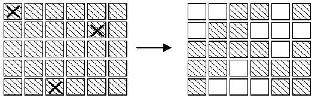

# 第3章 枚举

把问题所有可能的解一一进行检验，排除后得到正确可行解的过程称为枚举，这种方法是牺牲时间和空间来换取较高的准确性，所以当可能的解范围较大时，一般不建议使用这种方法。

枚举的时间复杂度一般为所有可能解的范围，但在绝大多数情况下，可以进行优化处理，缩小可能解的范围，或者根据问题的相关性质有选择性的跳跃搜索正解。

枚举简单粗暴，当可能的解范围确定时，暴力枚举所有可能的解，使用枚举算法时，要保证可能的解范围确定，并且一定能在这个范围内找到正解，其本质上就是搜索。

## 3.1 水仙花数

**[题面]**

水仙花数是指一个 $$n$$ 位数（$$n \geq 3$$），它每个位上的数字的 $$n$$ 次幂之和等于它本身（如 $$1^3+5^3+3^3=153$$ ），求出所有三位数的水仙花数。

**[输入]**

无输入。

**[输出]**

从小到大顺序输出所有水仙花数，每行输出一个水仙花数。

**[思路1]**

直接遍历100~999，判断每个数是否满足是水仙花数的条件。判断的时候把每个数拆分出个位、十位、百位，然后判断是否满足。

**[思路2]**

利用三重循环，分别模拟个位、十位、百位，然后输出满足条件的数。

## 3.2 百钱买百鸡

**[题面]**

元前五世纪，我国古代数学家张丘建在《算经》一书中提出了“百鸡问题”：鸡翁一值钱五，鸡母一值钱三，鸡雏三值钱一。百钱买百鸡，问鸡翁、鸡母、鸡雏各几何？

本程序要求解的问题是：给定一个正整数$$n$$，用$$n$$文钱买$$n$$只鸡，问公鸡、母鸡、小鸡各买多少只？

**[输入]**

输入一个正整数 $$n(n<=100)$$。

**[输出]**

如果有解，每种组合占一行，包含公鸡、母鸡、小鸡的个数，用正整数表示，每个数据占4列。公鸡母鸡小鸡个数均大于等于0，按公鸡数目从小到大输出，公鸡数目相同按母鸡数目从小到大输出，以此类推。如果无解，输出“No Answer”。

**[样例输入]**

```
100
```

**[样例输出]**

```
0 25 75
4 18 78
8 11 81
12 4 84
```

**[思路1]**

根据题意，假设 $$ x $$ 只公鸡， $$ y $$ 只母鸡，$$ z $$ 只小鸡，可以得到方程组

$$
\begin{cases}  
	5x+3y+z/3 = n \\
	x+y+z = n
\end{cases}
$$

其中， $$ 0 \leq x,y,z \leq n \ \ \& \& \ \ z \% 3 == 0 $$ ，然后可以对其进行一一枚举。

**[思路2]**

通过已知条件对方法1进行优化，减少枚举次数。3种鸡的总数是固定的，只需要枚举公鸡和母鸡，即可确定小鸡的数量 $$z == n-x-y$$ ，这样就缩小了枚举范围，去掉一个未知数，得到

$$
\begin{cases}
	7x+4y=n \\
	x+y+z=n
\end{cases}
$$

其中， $$0 \leq x,y,z \leq n \ \ \& \ \ z \% 3 == 0$$ 中的 $$x$$ 值可以缩小范围为 $$0 \leq x \leq \frac{n}{4}$$ 。

**[参考代码]**

``` cpp
#include <stdio.h>

int main(void) {
    int n, x, y, z;
    scanf("%d", &n);
    for(x=0; x<=n/4; ++x) {
        y = n-7*x;
        if(y%4==0 && y>=0) {
            y /= 4;
            z = 100-x-y;
            if(z%3==0 && 5*x+3*y+z/3==n)
                printf("%d %d %d\n", x, y, z);
        }
    }

    return 0;
}
```

## 3.3 完美立方

**[题面]**

形如 $$ a^3 = b^3 + c^3 + d^3 $$ 的等式被称为完美立方等式。例如 $$ 12^3 = 6^3 + 8^3 + 10^3$$  。编写一个程序，对任给的正整数 $$N(N \leq 100)$$ ，寻找所有的四元组 $$(a, b, c, d)$$ ，使得 $$a^3= b^3 + c^3 + d^3$$ ，其中$$a$$,$$b$$,$$c$$,$$d$$ 大于 1, 小于等于$$N$$，且 $$b \leq c \leq d$$。

**[输入]**

一个正整数 $$N (N \leq 100)$$。

**[题面]**

每行输出一个完美立方。

输出格式为： Cube = a, Triple = (b,c,d) 其中$$a$$，$$b$$，$$c$$，$$d$$所在位置分别用实际求出四元组值代入。 

请按照$$a$$的值，从小到大依次输出。当两个完美立方等式中a的值相同，则$$b$$值小的优先输出，仍相同则$$c$$值小的优先输出，再相同则$$d$$值小的先输出。

**[样例输入]**

```
24
```

**[样例输出]**

```
Cube = 6, Triple = (3,4,5)
Cube = 12, Triple = (6,8,10)
Cube = 18, Triple = (2,12,16)
Cube = 18, Triple = (9,12,15)
Cube = 19, Triple = (3,10,18)
Cube = 20, Triple = (7,14,17)
Cube = 24, Triple = (12,16,20)
```

**[思路]**

使用四重循环枚举a、b、c、d，a在最外层，d在最里层，每一层都是从小到大枚举。

- a的枚举范围：$$[ 2, N ]$$
- b的枚举范围：$$[ 2, a-1 ]$$
- c的枚举范围：$$[ b, a-1 ]$$
- d的枚举范围：$$[ c, a-1 ]​$$

**[参考代码]**

``` cpp
#include <stdio.h>

int main(void) {
    int n;
    scanf("%d", &n);
    for(int a=2; a<=n; ++a) 
        for(int b=2; b<a; ++b)
            for(int c=b; c<a; ++c)
                for(int d=c; d<a; ++d)
                    if(a*a*a == b*b*b + c*c*c + d*d*d)
                        printf("Cube = %d, Tripe = (%d,%d,%d)\n", a, b, c, d);
    return 0;
}
```

## 3.4 生理周期

**[题面]**

人生来就有三个生理周期，分别为体力、感情和智力周期，它们的周期长度为23天、28天和33天。每一个周期中有一天是高峰。在高峰这天，人会在相应的方面表现出色。例如，智力周期的高峰，人会思维敏捷，精力容易高度集中。因为三个周期的周长不同，所以通常三个周期的高峰不会落在同一天。对于每个人，我们想知道何时三个高峰落在同一天。对于每个周期，我们会给出从当前年份的第一天开始，到出现高峰的天数（不一定是第一次高峰出现的时间）。你的任务是给定一个从当年第一天开始数的天数，输出从给定时间开始（不包括给定时间）下一次三个高峰落在同一天的时间（距给定时间的天数）。例如：给定时间为10，下次出现三个高峰同天的时间是12，则输出2（注意这里不是3）。 

**[输入]**

多组数据。一行包含四个整数：$$p$$, $$e$$, $$i$$和$$d$$，相邻两个整数之间用单个空格隔开。 $$p$$, $$e$$, $$i$$分别表示体力、情感和智力高峰出现的时间（时间从当年的第一天开始计算）。$$d$$ 是给定的时间，可能小于$$p$$, $$e$$, 或 $$i$$。 所有给定时间是非负的并且小于等于365, 所求的时间小于等于21252。

**[输出]**

对每组数据输出一行，每行一个整数，即从给定时间起，下一次三个高峰同天的时间（距离给定时间的天数）。

**[样例输入]**

```
0 0 0 0 
0 0 0 100 
5 20 34 325 
4 5 6 7 
283 102 23 320 
203 301 203 40 
```

**[样例输出]**

```
21252
21152 
19575
16994
8910
10789
```

**[思路]**

从d+1天开始，一直试到第21252天，对其中每个日期k，看是否满足如下条件。

$$(k-p) \% 23 == 0 \ \ \&\&\ \ (k-e) \% 28 == 0 \ \ \&\& \ \ (k-i) \% 33 == 0$$

根据题意，对算法进行优化即可。

**[参考代码]**

``` cpp
#include <stdio.h>

int main(void) {
    int p, e, i, d;
    while(~scanf("%d %d %d %d", &p, &e, &i, &d)) {
        int k;
        for(k=d+1; (k-p)%23; ++k);
        for(; (k-e)%28; k+=23);
        for(; (k-i)%33; k+=23*28);
        printf("%d\n", k-d);
    }
    return 0;
}
```


## 3.5 假币问题

赛利有12枚银币。其中有11枚真币和1枚假币。假币看起来和真币没有区别，但是重量不同。但赛利不知道假币比真币轻还是重。于是他向朋友借了一架天平。朋友希望赛利称三次就能找出假币并且确定假币是轻是重。例如：如果赛利用天平称两枚硬币，发现天平平衡，说明两枚都是真的。如果赛利用一枚真币与另一枚银币比较，发现它比真币轻或重，说明它是假币。经过精心安排每次的称量，赛利保证在称三次后确定假币。

**[输入]**

第一行有一个数字$$n$$，表示有$$n$$组测试用例。

对于每组测试用例：

输入有三行，每行表示一次称量的结果。赛利事先将银币标号为A-L。每次称量的结果用三个以空格隔开的字符串表示：天平左边放置的硬币 天平右边放置的硬币 平衡状态。其中平衡状态用"up"，"down"， 或 "even"表示，分别为右端高、右端低和平衡。天平左右的硬币数总是相等的。

**[输出]**

输出哪一个标号的银币是假币，并说明它比真币轻还是重(heavy or light)。

**[样例输入]**

```
1 
ABCD EFGH even 
ABCI EFJK up 
ABIJ EFGH even 
```

**[样例输出]**

```
K is the counterfeit coin and it is light.
```


**[思路]**

对每一枚硬币先假设它是轻的，看这样是否符合称重的结果，如果符合，问题即解决。如果不符合，就假设它是重的，看是否符合称重的结果。把所有的硬币都试一遍，一定能找到特殊的硬币。

**[参考代码]**

``` cpp
#include <stdio.h>
#include <string.h>

char left[3][13];    // 天平左边的硬币
char right[3][13];   // 天平右边的硬币
char result[3][6];   // 结果

// light为1表示假设假币为轻，0表示为重
int isFake(char c, int light) {
    for(int i=0; i<3; ++i) {
        char * pLeft, *pRight;
        if(light) {
            pLeft = left[i];
            pRight = right[i];
        } else {
            pLeft = right[i];
            pRight = left[i];
        }
        
        switch(result[i][0]) {
        case 'u':
            if(strchr(pRight, c) == NULL)
                return 0;
            break;
        case 'd':
            if(strchr(pLeft, c) == NULL)
                return 0;
            break;
        case 'e':
            if(strchr(pLeft, c) || strchr(pRight, c))
                return 0;
            break;
        }
    }
    return 1;
}


int main(void) {
    int n;
    scanf("%d", &n);
    while(n--) {
        for(int i=0; i<3; ++i)
            scanf("%s %s %s", left[i], right[i], result[i]);
        for(char c='A'; c<='L'; ++c) {
            if(isFake(c, 1)) {
                printf("%c is the counterfeit coin and it is light\n", c);
                break;
            } 
            else if (isFake(c, 0)) {
                printf("%c is the counterfeit coin and it is heavy\n", c);
                break;
            }
        }
    }

    return 0;
}
```

## 3.6 猜数字

**[题面]**

猜数字游戏是gameboy最喜欢的游戏之一。游戏的规则是这样的：计算机随机产生一个四位数，然后玩家猜这个四位数是什么。每猜一个数，计算机都会告诉玩家猜对几个数字，其中有几个数字在正确的位置上。

比如计算机随机产生的数字为1122。如果玩家猜1234,因为1,2这两个数字同时存在于这两个数中，而且1在这两个数中的位置是相同的，所以计算机会告诉玩家猜对了2个数字，其中一个在正确的位置。如果玩家猜1111,那么计算机会告诉他猜对2个数字，有2个在正确的位置。

现在给你一段gameboy与计算机的对话过程，你的任务是根据这段对话确定这个四位数是什么。

**[输入]**

输入数据有多组。每组的第一行为一个正整数$$N(1 \leq N \leq 100)$$，表示在这段对话中共有$$N$$次问答。在接下来的$$N$$行中，每行三个整数$$A$$,$$B$$,$$C$$。gameboy猜这个四位数为$$A$$，然后计算机回答猜对了$$B$$个数字，其中$$C$$个在正确的位置上。当$$N=0$$时，输入数据结束。


**[输出]**

每组输入数据对应一行输出。如果根据这段对话能确定这个四位数，则输出这个四位数，若不能，则输出“Not sure”。

**[样例输入]**

```
6
4815 2 1
5716 1 0
7842 1 0
4901 0 0
8585 3 3
8555 3 2
2
4815 0 0
2999 3 3
0
```

**[样例输出]**

```
3585
Not sure
```

**[思路]**

因为随机产生的数一定是四位数，所以求解范围不大，可以使用枚举的方法。对于每一个四位数，判断其是否与输入中的对话冲突，但是在找到一个符合条件的数时，仍要继续枚举，指导出现第二个符合条件的数或者枚举完所有的四位数时，枚举结束。当有两个符合条件的数或者枚举结束都没找到一个符合条件的数时，输出“Not sure”，当且仅有一个符合条件数时，输出这个数。

**[参考代码]**

``` cpp
#include <stdio.h>
#include <string.h>

const int N = 110;
struct Arr{
    int a,b,c;
} arr[N];

int hashA[10], hashB[10];

int judge(int y, int n) {
    memset(hashA, 0, sizeof(hashA));

    int A1, B1, C1, D1, A2, B2, C2, D2;
    A1 = y%10;      hashA[A1]++;
    B1 = y/10%10;   hashA[B1]++;
    C1 = y/100%10;  hashA[C1]++;
    D1 = y/1000;    hashA[D1]++;

    for(int i=0; i<n; ++i) {
        memset(hashB, 0, sizeof(hashB));

        int x = arr[i].a;
        A2 = x%10;      hashB[A2]++;
        B2 = x/10%10;   hashB[B2]++;
        C2 = x/100%10;  hashB[C2]++;
        D2 = x/1000;    hashB[D2]++;

        int cnt1=0, cnt2=0;
        if(A1==A2) cnt1++;
        if(B1==B2) cnt1++;
        if(C1==C2) cnt1++;
        if(D1==D2) cnt1++;

        if(cnt1 != arr[i].c)
            return 0;

        for(int q=0; q<10; ++q)
            cnt2 += hashA[q]<hashB[q] ? hashA[q] : hashB[q];

        if(cnt2 != arr[i].b)
            return 0;
    }
    return 1;
}

int main(void) {
    int n;
    while(~scanf("%d", &n) && n) {
        for(int i=0; i<n; ++i)
            scanf("%d %d %d", &arr[i].a, &arr[i].b, &arr[i].c);
        int ans = -1;
        for(int i=1000; i<=9999; ++i) {
            if(judge(i, n)) {
                if(ans != -1) {
                    ans = -1;
                    break;
                }
                ans = i;
            }
        }
        if(ans == -1)
            printf("Not sure\n");
        else
            printf("%d\n", ans);
    }

    return 0;
}
```

## 3.7 熄灯问题

**[题面]**

有一个由按钮组成的矩阵，其中每行有6个按钮，共5行。每个按钮的位置上有一盏灯。当按下一个按钮后，该按钮以及周围位置(上边、下边、左边、右边)的灯都会改变一次。即，如果灯原来是点亮的，就会被熄灭；如果灯原来是熄灭的，则会被点亮。在矩阵角上的按钮改变3盏灯的状态；在矩阵边上的按钮改变4盏灯的状态；其他的按钮改变5盏灯的状态。

<div  style="width:450px; margin:0 auto;"></div>

在上图中，左边矩阵中用X标记的按钮表示被按下，右边的矩阵表示灯状态的改变。对矩阵中的每盏灯设置一个初始状态。请你按按钮，直至每一盏等都熄灭。与一盏灯毗邻的多个按钮被按下时，一个操作会抵消另一次操作的结果。在下图中，第2行第3、5列的按钮都被按下，因此第2行、第4列的灯的状态就不改变。

<div  style="width:450px; margin:0 auto;"></div>

请你写一个程序，确定需要按下哪些按钮，恰好使得所有的灯都熄灭。根据上面的规则，我们知道1）第2次按下同一个按钮时，将抵消第1次按下时所产生的结果。因此，每个按钮最多只需要按下一次；2）各个按钮被按下的顺序对最终的结果没有影响；3）对第1行中每盏点亮的灯，按下第2行对应的按钮，就可以熄灭第1行的全部灯。如此重复下去，可以熄灭第1、2、3、4行的全部灯。同样，按下第1、2、3、4、5列的按钮，可以熄灭前5列的灯。


**[输入]**

5行组成，每一行包括6个数字（0或1）。相邻两个数字之间用单个空格隔开。0表示灯的初始状态是熄灭的，1表示灯的初始状态是点亮的。

**[输出]**

5行组成，每一行包括6个数字（0或1）。相邻两个数字之间用单个空格隔开。其中的1表示需要把对应的按钮按下，0则表示不需要按对应的按钮。

**[样例输入]**

```
0 1 1 0 1 0
1 0 0 1 1 1
0 0 1 0 0 1
1 0 0 1 0 1
0 1 1 1 0 0
```

**[样例输出]**

```
1 0 1 0 0 1
1 1 0 1 0 1
0 0 1 0 1 1
1 0 0 1 0 0
0 1 0 0 0 0
```

**[思路]**

- 按下按钮顺序不影响最终结果；
- 按下一个按钮两次等价于没有按这个按钮，故每个按钮最多只需按一次。

一共30个开关，那么状态数是$$2^{30}$$，需要减少枚举的状态数目。

基本思路：如果存在某个局部，一旦这个局部状态被确定，那么剩余其它部分的状态只能是确定的一种，或者不多的n种，那么就只需枚举这个局部的状态即可。

经过观察，发现第1行就是这样一个“局部”。

- 因为第1行的各开关状态确定的状态下，这些开关作用过后，将导致第1行某些灯是亮的，某些灯是灭的。
- 要熄灭第1行某个亮着的灯（假设位于第i列），那么唯一的方法就是第2行第i列的按钮。（因为第1行的开关已经用过了，而第3行及其后面的开关不会影响到第1行）
- 为了使第1行的灯全部熄灭，第2行的合理开关状态就是唯一的。

枚举第1行状态数是$$2^6$$，同理枚举第1列状态数是$$2^5$$。

因为按钮状态只有开关两种，所以在是现实时可以通过位运算来实现。

**[参考代码]**

``` cpp
#include <stdio.h>
#include <string.h>

int get_bit(char c, int i) {
    return (c >> i) & 1;
}

void set_bit(char &c, int i, int v) {
    if(v)   c |= (1 << i);
    else    c &= ~(1 << i);
}

void flip_bit(char &c, int i) {
    c ^= (1 << i);
}

void output_result(char result[]) {
    for(int i=0; i<5; ++i) {
        for(int j=0; j<6; ++j) {
            printf("%d", get_bit(result[i], j));
            if(j<5) printf(" ");
        }
        printf("\n");
    }
}

int main(void) {
    char oriLights[5]={0};  // 最初读取到的灯矩阵
    char lights[5]={0};     // 模拟变换时的临时矩阵
    char result[5]={0};     // 结果开关方案矩阵

    // 读入灯矩阵最初状态
    for(int i=0; i<5; ++i) {
        for(int j=0; j<6; ++j) {
            int t;
            scanf("%d", &t);
            set_bit(oriLights[i], j, t);
        }
    }

    for(int n=0; n<64; ++n) { // 遍历第一行的64种状态
        memcpy(lights, oriLights, sizeof(oriLights));
        // 第i行的开关方案
        int switchs = n;
        for(int i=0; i<5; ++i) {
            result[i] = switchs;
            for(int j=0; j<6; ++j) {
                if(get_bit(switchs, j)) {
                    // 更改左灯状态
                    if(j>0) flip_bit(lights[i], j-1);
                    // 更改开关位置灯状态
                    flip_bit(lights[i], j);
                    // 更改右等状态
                    if(j<5) flip_bit(lights[i], j+1);
                }
            }
            // 更改下一行的灯因为当前行调整后的状态
            if(i<4) lights[i+1] ^= switchs;
            // 第i+1行的开关方案由第i行亮灯情况决定
            switchs = lights[i];
        }
        if(lights[4]==0) {
            output_result(result);  
            break;
        }
    }

    return 0;
}
```
