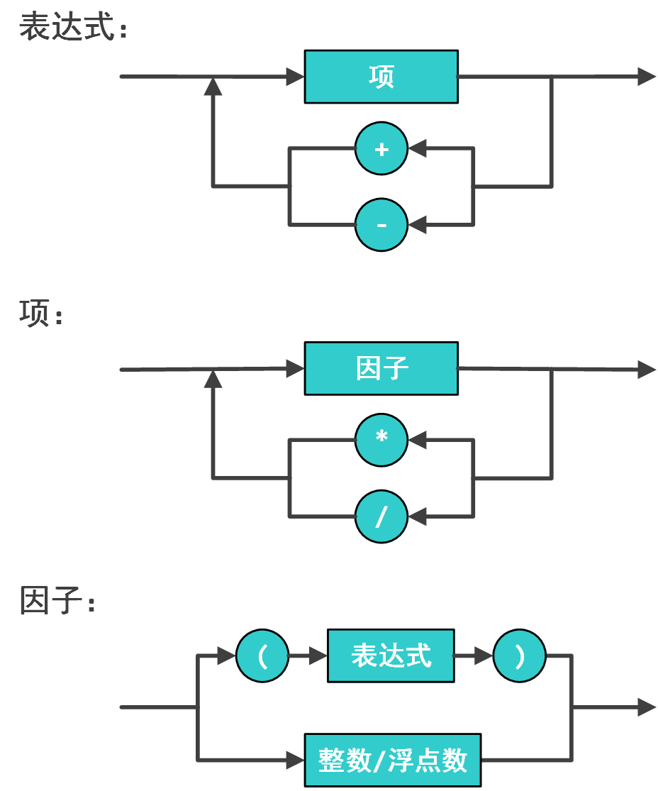

# 第4章 递归

一个函数直接或者间接调用自己本身，这种函数称为递归函数，而递归算法是把问题转化为规模缩小了的同类问题的子问题，然后调用递归函数表示问题的解，其思想是将一个大型而且复杂的问题层层简化，转化为一个与原问题相似的规模较小且简单的子问题，通过多次调用子问题得到最终复杂问题的解。

在递归调用的过程中，系统为每一层的返回点、局部变量等开辟了栈来存储，为了避免栈溢出的问题，递归需要有边界条件，必须有一个明确的递归出口。

## 4.1 母牛的故事

**[题面]**

有一头母牛，它每年年初生一头小母牛。每头小母牛从第四个年头开始，每年年初也生一头小母牛。请编程实现在第 $$n$$ 年的时候，共有多少头母牛？

**[输入]**

输入数据由多个测试实例组成，每个测试实例占一行，包括一个整数 $$n(0<n<55)$$，$$n$$ 的含义如题目中描述。

$$n=0$$ 表示输入数据的结束，不做处理。

**[输出]**

对于每个测试实例，输出在第 $$n$$ 年的时候母牛的数量。

每个输出占一行。

**[样例输入]**

```
2
4
5
0
```

**[样例输出]**

```
2
4
6
```

**[思路]**

假设第 $$n$$ 年母牛数为 $$cow[n]$$，根据题意可以知道 $$cow[1] =1$$， $$cow[2] = 2$$， $$cow[3] = 3$$；当 $$n>3$$ 时，就要推公式再进行递归求解。第 $$n$$ 年的母牛数可以分为两部分；第一部分为第 $$n-1$$ 年的母牛总数；第二部分为第 $$n$$ 年年初刚生育的小牛数，而第 $$n$$ 年年初刚生育的小牛数等于第 $$n-3$$ 年的母牛总数。所以，当 $$n>3$$ 时，$$cow[n] = cow[n-1] + cow[n-3]$$。

为了减少不必要的重复递归，可以使用数组 $$cow[i]$$ 进行记忆化递归。

**[参考代码]**

``` cpp
#include <stdio.h>

int cow[60] = {0};

int cowNumber(int n) {
    if(cow[n])
        return cow[n];

    if(n<4)
        return n;
    else 
        return cowNumber(n-1) + cowNumber(n-3);
}

int main(void) {
    int n;
    while(~scanf("%d", &n) && n!=0) {
        printf("%d\n", cowNumber(n));
    }
    return 0;
}
```

## 4.2 汉诺塔问题

**[题面]**

法国数学家爱德华·卢卡斯曾编写过一个印度的古老传说：在世界中心贝拿勒斯（在印度北部）的圣庙里，一块黄铜板上插着三根宝石针。印度教的主神梵天在创造世界的时候，在其中一根针上从下到上地穿好了由大到小的64片金片，这就是所谓的汉诺塔。不论白天黑夜，总有一个僧侣在按照下面的法则移动这些金片：一次只移动一片，不管在哪根针上，小片必须在大片上面。僧侣们预言，当所有的金片都从梵天穿好的那根针上移到另外一根针上时，世界就将在一声霹雳中消灭，而梵塔、庙宇和众生也都将同归于尽。

不管这个传说的可信度有多大，如果考虑一下把64片金片，由一根针上移到另一根针上，并且始终保持上小下大的顺序。这需要多少次移动呢?这里需要递归的方法。假设有 $$n$$ 片，移动次数是$$f(n)$$。 显然 $$f(1)=1,f(2)=3,f(3)=7$$，且 $$f(k+1)=2*f(k)+1$$。此后不难证明 $$f(n)=2^n-1$$。$$n=64$$时， 假如每秒钟一次，共需多长时间呢？一个平年365天有31536000秒，闰年366天有31622400秒，平均每年31556952秒，计算一下： 18,446,744,073,709,551,615秒 这表明移完这些金片需要5845.54亿年以上，而地球存在至今不过45亿年，太阳系的预期寿命据说也就是数百亿年。真的过了5845.54亿年，不说太阳系和银河系，至少地球上的一切生命，连同梵塔、庙宇等，都早已经灰飞烟灭。

**[输入]**

输入为一个整数后面跟三个单字符字符串。

整数为盘子的数目，后三个字符表示三个杆子的编号。

**[输出]**

输出每一步移动盘子的记录。一次移动一行。

每次移动的记录为例如3:a->b 的形式，即把编号为3的盘子从a杆移至b杆。

我们约定圆盘从小到大编号为 $$1, 2, ...n$$。即最上面那个最小的圆盘编号为$$1$$，最下面最大的圆盘编号为 $$n$$。


**[样例输入]**

```
3 a b c
```

**[样例输出]**

```
1:a->c
2:a->b
1:c->b
3:a->c
1:b->a
2:b->c
1:a->c
```

**[思路]**

解法的基本思想是递归。假设有A、B、C三个塔，A塔有N块盘，目标是把这些盘全部移到C塔。那么先把A塔顶部的N-1块盘移动到B塔，再把A塔剩下的大盘移到C，最后把B塔的N-1块盘移到C。 每次移动多于一块盘时，则再次使用上述算法来移动。

**[参考代码]**

``` cpp
#include <stdio.h>

// 将src座上的n个盘子以mid座为中转移动到dest座，
// src座上最上方盘子编号是src_n
void hanoi(int n, char src, char mid, char dest, int src_n) {
    if(n == 1) { 
        // 只需移动一个盘子，直接将盘子从src移动到dest即可
        printf("%d:%c->%c\n", src_n, src, dest);
        return;
    }

    // 先将n-1个盘子从src移动到mid
    hanoi(n-1, src, dest, mid, src_n);
    // 再将第n个盘子从src移动到dest
    printf("%d:%c->%c\n", src_n+n-1, src, dest);
    // 最后将n-1个盘子从mid移动到dest
    hanoi(n-1, mid, src, dest, src_n); 

    return ;
}

int main(void) {
    char a, b, c;
    int n;
    scanf("%d %c %c %c", &n, &a, &b, &c);

    hanoi(n, a, b, c, 1);

    return 0;
}
```

## 4.3 逆波兰表达式

**[题面]**

逆波兰表达式是一种把运算符前置的算术表达式，例如普通的表达式2 + 3的逆波兰表示法为+ 2 3。逆波兰表达式的优点是运算符之间不必有优先级关系，也不必用括号改变运算次序，例如(2 + 3) \* 4的逆波兰表示法为\* + 2 3 4。本题求解逆波兰表达式的值，其中运算符包括+ - \* /四个。

**[输入]**

输入为一行，其中运算符和运算数之间都用空格分隔，运算数是浮点数。

**[输出]**

输出为一行，表达式的值。
可直接用printf("%f\n", v)输出表达式的值v。

**[样例输入]**

\* + 11.0 12.0 + 24.0 35.0

**[样例输出]**

1357.000000

**[提示]**

样例输入含义：(11.0+12.0)\*(24.0+35.0)

可使用atof(str)把字符串转换为一个double类型的浮点数。atof定义在stdlib.h中。

此题可使用函数递归调用的方法求解。

**[思路]**

本题中“逆波兰表达式”的定义：

1.  一个数是一个逆波兰表达式，值为该数
2. "运算符  逆波兰表达式  逆波兰表达式" 是逆波兰表达式，值为两个逆波兰表达式的值运算的结果

一般教科书将本题中的“逆波兰表达式”称为“波兰表达式”，而将运算符后置的表达式成为“逆波兰表达式”

**[参考代码]**

``` cpp
#include <stdio.h>
#include <stdlib.h>

double exp() {
    char s[100];
    scanf("%s", s);
    switch(s[0]) {
    case '+':
        return exp() + exp();
    case '-':
        return exp() - exp();
    case '*':
        return exp() * exp();
    case '/':
        return exp() / exp();
    default:
        return atof(s);
    }
}

int main(void) {
    printf("%f\n", exp());

    return 0;
}
```

## 4.4 N皇后问题

**[题面]**

在 $$N*N$$ 的方格棋盘放置了 $$N$$ 个皇后，使得它们不相互攻击（即任意2个皇后不允许处在同一排，同一列，也不允许处在与棋盘边框成45角的斜线上。

你的任务是，对于给定的 $$N$$，求出有多少种合法的放置方法。

**[输出]**

共有若干行，每行一个正整数 $$N≤10$$，表示棋盘和皇后的数量；如果 $$N=0$$，表示结束。

**[输出]**

共有若干行，每行一个正整数，表示对应输入行的皇后的不同放置数量。


**[样例输入]**

```
1
8
5
0
```

**[样例输出]**

```
1
92
10
```

**[思路]**

通过递归逐层枚举皇后存放位置即可，具体过程看代码注释。

**[参考代码]**

``` cpp
#include <stdio.h>
#include <math.h>

// 用来存放算好的皇后位置，最左上角是(0,0)
int queenPos[100];
// counts[i]=j 表示i个皇后时摆放情况有j个
int counts[10];

// 在0~k-1 行皇后已经摆好的情况下，摆第k行及其后的皇后
void putQueen(int k, int n) { 
    // N 个皇后已经摆好
    if(k == n) { 
        counts[n]++;
        return ;
    }

    // 逐列尝试寻找第k个皇后的位置
    for(int i=0; i<n; i++) { 
        int j;
        // 和已经摆好的 k 个皇后的位置比较，看是否冲突
        for(j=0; j<k; j++) {
            if(queenPos[j]==i || abs(queenPos[j]-i) == abs(k-j)) {
                // 冲突，则试下一个位置
                break; 
            }
        } 
        // 当前选的位置 i 和已经摆好的皇后位置不冲突
        if(j == k) { 
            // 将第k个皇后摆放在位置i
            queenPos[k] = i; 
            // 求 k+1 个皇后的摆放位置
            putQueen(k+1, n);
        }
    }
}

int main(void) {
    for(int i=1; i<11; ++i) {
        putQueen(0, i);
    }

    int n;
    while(~scanf("%d", &n) && n) {
        printf("%d\n", counts[n]);
    }

    return 0;
}
```

## 4.5 EOF牛肉串

**[题面]**

今年的ACM暑期集训队一共有18人，分为6支队伍。其中有一个叫做EOF的队伍，由04级的阿牛、XC以及05级的COY组成。在共同的集训生活中，大家建立了深厚的友谊，阿牛准备做点什么来纪念这段激情燃烧的岁月，想了一想，阿牛从家里拿来了一块上等的牛肉干，准备在上面刻下一个长度为n的只由"E" "O" "F"三种字符组成的字符串（可以只有其中一种或两种字符，但绝对不能有其他字符）,阿牛同时禁止在串中出现O相邻的情况，他认为，"OO"看起来就像发怒的眼睛，效果不好。

你能帮阿牛算一下一共有多少种满足要求的不同的字符串吗？

**[输入]**

输入数据包含多个测试实例,每个测试实例占一行，由一个整数 $$n$$ 组成，$$(0<n<40)$$。

**[输出]**

对于每个测试实例，请输出全部的满足要求的涂法，每个实例的输出占一行。

**[样例输入]**

```
1
2
```

**[样例输出]**

```
3
8
```

**[思路]**

因为两个 O 不能连在一起，所以考虑两种单独的情况。设长度为 $$n$$ 时的 $$x[n]=a[n]+b[n]$$，其中，$$a[n]$$ 代表长度为 $$n$$ 时末尾为 O 的情况总和， $$b[n]$$ 代表长度为 $$n$$ 时末尾不为 O 的情况总和。

那么分情况讨论：

当长度为 $$n$$，末尾为 O 时，再加一个单位的长度有两种加法，即 E，F。

当长度为 $$n$$，末尾不为 O 时，再加一个单位的长度有三种加法，即 E，O，F。

所以 $$x[n+1] = a[n+1] + b[n+1] = 2*a[n] + 3*b[n] = 2*x[n] + b[n]$$ 。

而 $$b[n]$$ 又由 $$x[n-1]$$ 推来，$$x[n-1] = a[n-1] + b[n-1]$$，在长度为 $$n-1$$ 且末尾为 O 时，要将它变成长度为 $$n$$ 且末尾不为 O 有两种方法（E，F），即 $$2*a[n-1]​$$。

同理，在长度为 $$n-1$$ 且末尾不为 O 时，要将它变成长度为 $$n$$ 且末尾不为 O 有两种方法（E，F），即 $$2*b[n-1]$$。

所以 $$x[n+1] = 2*x[n] + b[n] = 2*x[n] + 2*x[n-1]$$。

**[参考代码]**

``` cpp
#include <stdio.h>

int main(void) {
    long long arr[50] = {0};
    arr[1] = 3;
    arr[2] = 8;
    for(int i=3; i<41; ++i)
        arr[i] = 2*arr[i-1] + 2*arr[i-2];

    int n;
    while(~scanf("%d", &n))
        printf("%lld\n", arr[n]);

    return 0;
}
```

## 4.6 RPG难题

**[题面]**

著名的RPG难题:

有排成一行的 $$ｎ$$ 个方格，用红(Red)、粉(Pink)、绿(Green)三色涂每个格子，每格涂一色，要求任何相邻的方格不能同色，且首尾两格也不同色。求全部的满足要求的涂法。

**[输入]**

输入数据包含多个测试实例,每个测试实例占一行,由一个整数N组成，(0<n<=50)。


**[输出]**

对于每个测试实例，请输出全部的满足要求的涂法，每个实例的输出占一行。

**[样例输入]**

```
1
2
```

**[样例输出]**

```
3
6
```

**[思路]**

当长度为 $$n$$ 时，满足要求的涂法为 $$x[n]$$，设3中颜色为A、B、C，由 $$x[n]$$ 推出 $$x[n+1]$$。

若长度为 $$n$$ 时，序列为 ABC···BAC，那么在后面加一个，只有一种加法，因为既要与开头不一样，又要与末尾不一样，所以只能加 B，因此从 $$n$$ 变为 $$n+1$$ 只有一种方法。

然而，还有种情况忽略了，就是当长度为 $$n-1$$ 时，序列为 ABC···CB 时，若在其后加一个 A 变成 ABC···CBA 是不符合题意的，但可以在后面加两个让其变得有意义，如 ABC···CBAC 或者 ABC···CBAB，可得出从 $$n-1$$ 变为 $$n+1$$ 有两种方法。

所以，可以退出公式 $$x[n] = x[n-1] + 2*x[n-2]$$。

**[参考代码]**

``` cpp
#include <stdio.h>

int main(void) {
    long long arr[60] = {0};
    arr[1] = 3;
    arr[2] = arr[3] = 6;
    for(int i=4; i<=50; ++i)
        arr[i] = arr[i-1] + 2*arr[i-2];

    int n;
    while(~scanf("%d", &n))
        printf("%lld\n", arr[n]);

    return 0;
}
```

## 4.7 放苹果

**[题面]**

把 $$M$$ 个同样的苹果放在 $$N$$ 个同样的盘子里，允许有的盘子空着不放，问共有多少种不同的分法？（用K表示）5，1，1和1，5，1 是同一种分法。

**[输入]**

第一行是测试数据的数目 $$t(0 \leq t \leq 20)$$。以下每行均包含二个整数 $$M$$ 和 $$N$$ ，以空格分开。$$1 \leq M，N \leq 10$$。

**[输出]**

对输入的每组数据 $$M$$ 和 $$N$$ ，用一行输出相应的$$K$$。

**[样例输入]**

```
1
7 3
```

**[样例输出]**

```
8
```

**[思路]**

设 $$M$$ 个苹果放在 $$N$$ 个盘子里放法总数是 $$f(M,N)$$，则：

$$N > M$$ 时，$$f(M,N) = f(M,M)$$

$$N <= M$$ 时，总放法 = 有盘子为空的放法 + 没盘子为空的放法

$$f(M,N) = f(M,N-1) + f(M-N,N)$$

边界条件：当苹果数为0时，1种放法；当盘子数为0时，0种放法。


**[参考代码]**

``` cpp
#include <stdio.h>

int f(int m, int n) {
    if(n > m)
        return f(m, m);
    if(m == 0)
        return 1;
    if(n <= 0)
        return 0;
    return f(m, n-1) + f(m-n, n);
}

int main(void) {
    int t, m, n;
    scanf("%d", &t);
    while(t--) {
        scanf("%d %d", &m, &n);
        printf("%d\n", f(m, n));
    }

    return 0;
}
```

## 4.8 算24

**[题面]**

给出4个小于10个正整数，你可以使用加减乘除4种运算以及括号把这4个数连接起来得到一个表达式。现在的问题是，是否存在一种方式使得得到的表达式的结果等于24。

这里加减乘除以及括号的运算结果和运算的优先级跟我们平常的定义一致（这里的除法定义是实数除法）。

比如，对于5，5，5，1，我们知道 $$5 * (5 – 1 / 5) = 24$$，因此可以得到24。又比如，对于1，1，4，2，我们怎么都不能得到 $$24$$。

**[输入]**

输入数据包括多行，每行给出一组测试数据，包括4个小于10个正整数。最后一组测试数据中包括4个0，表示输入的结束，这组数据不用处理。

**[输出]**

对于每一组测试数据，输出一行，如果可以得到24，输出“YES”；否则，输出“NO”。

**[样例输入]**

```
5 5 5 1
1 1 4 2
0 0 0 0
```

**[样例输出]**

```
YES
NO
```

**[思路]**

$$n$$ 个数算 $$24$$ ，必有两个数要先算。这两个数算的结果，和剩余 $$n-2$$ 个数，就构成了 $$n-1$$ 个数求 $$24$$ 的问题。

枚举先算的两个数，以及这两个数的运算方式。

边界条件：一个数算 $$24$$

注意：浮点数不能直接判等。

**[参考代码]**

``` cpp
#include <stdio.h>
#include <stdlib.h>
#include <math.h>
 
#define EPS 1e-6

int isZero(double x) {
    return fabs(x) <= EPS;
}

int count24(double arr[], int count) {
    if(1 == count) {
        if(isZero(arr[0] - 24))
            return 1;
        else
            return 0;
    }

    double tempArr[6];
    for(int i=0; i<count-1; ++i) {
        for(int j=i+1; j<count; ++j) {
            // 每次枚举两个数进行组合 arr[i] 和 arr[j]
            int m=0;
            // 将其余数字放入tempArr中
            for(int k=0; k<count; ++k) {
                if(k!=i && k!=j) {
                    tempArr[m++] = arr[k];
                }
            }

            tempArr[m] = arr[i] + arr[j];
            if(count24(tempArr, m+1))
                return 1;

            tempArr[m] = arr[i] - arr[j];
            if(count24(tempArr, m+1))
                return 1;

            tempArr[m] = arr[j] - arr[i];
            if(count24(tempArr, m+1))
                return 1;

            tempArr[m] = arr[i] * arr[j];
            if(count24(tempArr, m+1))
                return 1;

            if(!isZero(arr[i])) {
                tempArr[m] = arr[j] / arr[i];
                if(count24(tempArr, m+1))
                    return 1;
            }

            if(!isZero(arr[j])) {
                tempArr[m] = arr[i] / arr[j];
                if(count24(tempArr, m+1))
                    return 1;
            }
        }
    }
    return 0;
}

int main(void) {
    double arr[5];
    while(~scanf("%lf %lf %lf %lf", arr, arr+1, arr+2, arr+3) 
            && !isZero(arr[0])) {
        printf("%s\n", count24(arr, 4) ? "YES" : "NO");
    }

    return 0;
}
```

## 4.9 \*四则运算表达式求值

**[题面]**

求一个可以带括号的小学算术四则运算表达式的值。

**[输入]**

一行，一个四则运算表达式。'\*'表示乘法，'/'表示除法。

**[输出]**

一行，该表达式的值，保留小数点后面两位。

**[样例输入1]**

```
3.4
```

**[样例输出1]**

```
3.40
```

**[样例输入2]**

```
7+8.3
```

**[样例输出2]**

```
15.30
```

**[样例输入3]**

```
3+4.5*(7+2)*(3)*((3+4)*(2+3.5)/(4+5))-34*(7-(2+3))
```

**[样例输出3]**

```
454.75
```

**[思路]**

表达式是一个递归定义，因此可对表达式进行递归分析处理。

<div  style="float:left; width:400px; margin:0 auto;"></div>

<div style="width:100%; clear:both;" ></div>

**[参考代码]**

``` cpp
#include <iostream>
#include <stdio.h>
#include <string.h>
#include <stdlib.h>
using namespace std;

double expression_value();
double term_value();
double factor_value();

// 获取一个表达式的值
double expression_value() {
    // 求第一项的值
    double result = term_value(); 
    while(1) {
        // 从缓存区获取一个字符，并不从缓存区取走
        char op = cin.peek(); 
        if('+'==op || '-'==op) {
            // 从缓存区读出运算符
            cin.get(); 
            // 从缓存区读取另一项的值
            double value = term_value();
            if('+' == op) 
                result += value;
            else 
                result -= value;
        }
        else break;
    }
    return result;
}

// 获取一个项的值
double term_value() {
    // 求第一个因子的值
    double result = factor_value(); 
    while(1) {
        char op = cin.peek();
        if('*'==op || '/'==op) {
            // 从缓存区读出运算符
            cin.get();
            // 读取运算符后的另一个因子的值
            double value = factor_value();
            if('*' == op)
                result *= value;
            else 
                result /= value;
        }
        else break;
    }
    return result;
}

// 获取一个因子的值
double factor_value() {
    double result = 0;
    char c = cin.peek();
    if('(' == c) {
        cin.get();  // 从缓存区读出 '('
        // 读取括号中表达式的值
        result = expression_value();
        cin.get();  // 从缓存区读出 ')'
    } else {
        // 读取小数点前面数值
        while(isdigit(c)) {
            result = result*10 + (c-'0');
            cin.get();
            c = cin.peek();
        }
        // 如果存在小数点读取小数点后面数值
        if('.' == c) {
            cin.get();
            c = cin.peek();
            double f = 0.1;
            while(isdigit(c)) {
                result = result + (c-'0')*f;
                f *= 0.1;
                cin.get();
                c = cin.peek();
            }
        }
    }
    return result;
}


int main(void) {
    printf("%.2lf\n", expression_value());

    return 0;
}
```