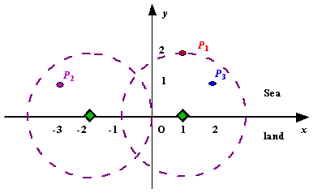

# 第5章 贪心


贪心算法是指在对问题求解时，总是选取当前最优策略的算法，其不是从整体上考虑，而是从某种意义上得到局部的最优解，使用贪心算法时，一定要保证无后效性，即当前选择的状态不会对以后的状态产生影响。

求解时，把问题分为若干个子问题进行求解，得到子问题的局部最优解，因为其满足无后效性，局部最优解能导致全局最优解。

## 5.1 圣诞老人的礼物

**[题面]**

圣诞节来临了，在城市A中圣诞老人准备分发糖果，现在有多箱不同的糖果，每箱糖果有自己的价值和重量，每箱糖果都可以拆分成任意散装组合带走。圣诞老人的驯鹿最多只能承受一定重量的糖果，请问圣诞老人最多能带走多大价值的糖果。

**[输入]**

第一行由两个部分组成，分别为糖果箱数正整数 $$n(1 \leq n \leq 100)$$，驯鹿能承受的最大重量正整数 $$w(0 < w < 10000)$$ ，两个数用空格隔开。其余 $$n$$ 行每行对应一箱糖果，由两部分组成，分别为一箱糖果的价值正整数 $$v$$ 和重量正整数 $$w$$ ，中间用空格隔开。

**[输出]**

输出圣诞老人能带走的糖果的最大总价值，保留1位小数。输出为一行，以换行符结束。

**[样例输入]**

```
4 15
100 4
412 8
266 7
591 2
```

**[样例输出]**

```
1193.0
```

**[思路]**

按礼物的 价值/重量 比从大到小依次选取礼物，对选取的礼物尽可能多地装，直到达到总重量 $$w$$ 。


**[参考代码]**

``` cpp
#include <stdio.h>
#include <algorithm>
using namespace std;

const double eps = 1e-6;

struct Candy {
    int v; 
    int w;
    bool operator < (const Candy & c) const { 
        return double(v)/w - double(c.v)/c.w > eps; 
    }
} candies[110];

int main(void) {
    int n, w;
    scanf("%d %d", &n, &w);
    for(int i=0; i<n; ++i)
        scanf("%d%d", &candies[i].v , &candies[i].w);
    sort(candies, candies+n);
    
    int totalW = 0;
    double totalV = 0;
    for(int i=0; i<n; ++i) {
        if(totalW + candies[i].w <= w) {
            totalW += candies[i].w;
            totalV += candies[i].v;
        }
        else {
            totalV += candies[i].v * double(w-totalW)/candies[i].w;
            break;
        }
    }
    printf("%.1f",totalV);

    return 0;
}
```

## 5.2 电影节

**[题面]**

大学生电影节在北大举办! 这天，在北大各地放了多部电影，给定每部电影的放映时间区间，区间重叠的电影不可能同时看（端点可以重合），问李雷最多可以看多少部电影。

**[输入]**

多组数据。每组数据开头是 $$n(n \leq 100)$$，表示共 $$n$$ 场电影。

接下来 $$n$$ 行，每行两个整数(0到1000之间)，表示一场电影的放映区间。

$$n=0$$ 则数据结束。

**[输出]**

对每组数据输出最多能看几部电影

**[样例输入]**

```
8
3 4
0 7 
3 8 
15 19
15 20
10 15
8 18 
6 12 
0
```

**[样例输出]**

```
3
```

**[思路]**

将所有电影按结束时间从小到大排序，第一步选结束时间最早的那部电影。然后，每步都选和上一部选中的电影不冲突且结束时间最早的电影。

**[参考代码]**

``` cpp
#include <iostream>
#include <stdio.h>
#include <algorithm>
using namespace std;

struct film{
    int s;
    int e;
    bool operator< (const film &c) const {
        return e <= c.e;
    }
} films[100+5];

int main(void) {
    int n;
    while((scanf("%d",&n)!=EOF)&&(n!=0)){
        for(int i=0; i<n; ++i)
            scanf("%d %d", &films[i].s, &films[i].e);

        sort(films, films+n);

        int sum=1;
        int endtime = films[0].e;
        for(int i=1; i<n; ++i) {
            if(films[i].s >= endtime){
                endtime = films[i].e;
                sum++;
            }
        }
        printf("%d\n", sum);
    }
    return 0;
}
```

## 5.3 做作业

**[题面]**

Ignatius有很多作业要做，每门作业都有一个最迟期限，如果没有在最迟期限内完成，就会扣除相应的分数。假设做每门作业都要一天时间，你能帮他规划出扣分最少的做作业顺序吗？

**[输入]**

输入包含多组测试数据。输入的第一行为一个数 $$T$$，表示测试组数，接下来包括 $$T$$ 组测试数据，每组测试数据的第一行为一个整数 $$N(1 \leq N \leq 1000)$$，表示作业门数，接下来有两行，第一行有 $$N$$ 个数字，分别表示每门作业的最迟期限，第二行有 $$N$$ 个数字，分别表示未完成作业扣除的相应分数。

**[输出]**

对于每组测试数据，输出扣除的最少分数，每行对应一个数据答案。

**[样例输入]**

```
3
3
3 3 3
10 5 1
3
1 3 1
6 2 3
7
1 4 6 4 2 4 3
3 2 1 7 6 5 4
```

**[样例输出]**

```
0
3
5
```

**[思路]**

题目中求解扣除的最少分数，那么从分数下手，优先完成分数高的作业，所以将作业按照分数进行排序，其次考虑怎样安排顺序。

``` 
作业: A B C D E F G
期限: 1 4 6 4 2 4 3
扣分: 3 2 1 7 6 5 4
```

用样例3来分析，假设第一天做了“作业A”，第二天做了“作业E”，第三天做了“作业G”，那么第四天会选择扣分更高的“作业D”，若这样安排，第四天会产生扣分7（“作业B” + “作业F”），很明显不是最优解。

其实可以用第三天做“作业F”，第一天做“作业G”，这样就能达到最优解，所以我们不能正向考虑，应该把时间用来做尽可能扣分高的作业，直接按照时间从大到小进行枚举，判断在最迟期限前是否能完成它，需要用到一个标记数组来辅助判断该天是否已被占用。

**[参考代码]**

``` cpp
#include <stdio.h>
#include <stdlib.h>
#include <string.h>
#include <algorithm>

const int N = 1010;

struct Work {
    int time;
    int score;
    friend bool operator < (const Work &a, const Work &b) {
        return a.score > b.score;
    }
} workArr[N];

int doneArr[N];

int main(void) {
    int t, n;
    scanf("%d", &t);
    while(t--) {
        scanf("%d", &n);
        for(int i=0; i<n; ++i) 
            scanf("%d", &workArr[i].time);

        for(int i=0; i<n; ++i) 
            scanf("%d", &workArr[i].score);

        // 根据扣分从大到小排序
        std::sort(workArr, workArr+n);
    
        memset(doneArr, 0, sizeof(doneArr));

        int ans = 0;
        for(int i=0; i<n; ++i) {
            // 如果最迟期限那天被占用了
            if(doneArr[workArr[i].time]) {
                int x = workArr[i].time;
                // 向前枚举寻找是否有空闲天数
                while(x && doneArr[x]) x--;
                // 如果有空闲天数则占用
                if(x) doneArr[x] = 1;
                // 没有空闲天数则累加扣分
                else ans += workArr[i].score;
            }
            else
                doneArr[workArr[i].time] = 1;
        }
        printf("%d\n", ans);
    }

    return 0;
}
```

## 5.4 保护花园

**[题面]**

农夫去砍柴，留下了 $$N(2 \leq N \leq 100,000)$$ 头牛吃草，等农夫砍柴回来发现所有的牛都在花园中破坏花朵。农夫决定依次将每头牛牵回牛棚，但在这个过程中，其它仍留在花园中的牛会继续破坏花朵，牵一头牛回牛棚的单程时间为 $$Ti(1 \leq Ti \leq 2,000,000)$$，牛在花园中每分钟破坏花朵数为 $$Di(1 \leq Di \leq 100)$$ 。请编写一段程序，决定牵牛回牛棚的顺序以保证破坏的总花朵数最少。

**[输入]**

第一行：一个整数 $$N$$ 。

第二行到第N+1行：每一行包括两个整数，分别表示为 $$Ti$$ 和 $$Di$$ 。

**[输出]**

输出一个数字表示被破坏的最少花朵数。

**[样例输入]**

```
6
3 1
2 5
2 3
3 2
4 1
1 6
```

**[样例输出]**

```
86
```

**[思路]**

因为牵一头牛的单程时间是 $$Ti$$ ，当把一头牛牵到牛棚再回来牵第二头牛的时间为 $$2*Ti$$ ，假设两头牛分别为 $$CowX$$、$$CowY$$，分别对应 $$CowXt$$、$$CowXd$$、$$CowYt$$、$$CowYd$$ 。

如果先牵 $$CowX$$，那么被破坏的花朵数为 $$2 * CowXt * CowYd$$ 。

如果先牵 $$CowY$$，那么被破坏的花朵数为 $$2 * CowYt * CowXd$$ 。

对于上面两个式子同时除以 $$2 * CowXt * CowYt$$ 可以分别得到 $$\frac{CowYd}{CowYt}$$，$$\frac{CowXd}{CowXt}$$ 。

那么当 $$\frac{CowYd}{CowYt} < \frac{CowXd}{CowXt}$$ 时，表示先牵 $$CowX$$ 更优，反之则牵 $$CowY$$ 更优，综上把每头牛的 $$Di$$ 和 $$Ti$$ 相除按照从大到小的顺序排序，再枚举可求值。

**[参考代码]**

``` cpp
#include <stdio.h>
#include <algorithm>

typedef long long ll;
const int N = 100010;

struct Cow {
    int t;
    int d;
    friend bool operator < (const Cow &a, const Cow &b) {
        return 1.0*a.d/a.t > 1.0*b.d/b.t;
    }
} cowArr[N];


int main(void) {
    int n;
    scanf("%d", &n);

    ll sumD = 0;
    for(int i=0; i<n; ++i) {
        scanf("%d %d", &cowArr[i].t, &cowArr[i].d);
        sumD += cowArr[i].d;
    }

    std::sort(cowArr, cowArr+n);

    ll ans = 0;
    for(int i=0; i<n; ++i) {
        sumD -= cowArr[i].d;
        ans += cowArr[i].t * 2 * sumD;
    }
    printf("%lld\n", ans);

    return 0;
}
```


## 5.5 畜栏保留问题

**[题面]**

农场有 $$N$$ 头牛，每头牛会在一个特定的时间区间 $$[A, B]$$（包括$$A$$和$$B$$）在畜栏里挤奶，且一个畜栏里同时只能有一头牛在挤奶。现在农场主希望知道最少几个畜栏能满足上述要求，并要求给出每头牛被安排的方案。对于多种可行方案，主要输出一种即可。（*Special judged*）

去同一个畜栏的两头牛，它们挤奶时间区间哪怕只在端点重合也是不可以的。

**[输入]**

输入的第一行包含一个整数 $$N(1 \leq N \leq 50, 000)$$，表示有 $$N$$ 牛头；接下来 $$N$$ 行每行包含两个数，分别表示这头牛的挤奶时间 $$[Ai, Bi] (1 \leq A \leq B \leq 1, 000, 000)$$。

**[输出]**

输出的第一行包含一个整数，表示最少需要的畜栏数；接下来 $$N$$ 行，第 $$i+1$$ 行描述了第 $$i$$ 头牛所被分配的畜栏编号（从1开始）。

**[样例输入]**

```
5
1 10
2 4
3 6
5 8
4 7
```

**[样例输出]**

```
4
1
2
3
2
4
```

**[思路]**

所有奶牛都必须挤奶。到了一个奶牛的挤奶开始时间，就必须为这个奶牛找畜栏。因此按照奶牛的开始时间逐个处理它们，是必然的。

S(x)表示奶牛x的开始时间。E(x)表示x的结束时间。对E(x), x可以是奶牛，也可以是畜栏。畜栏的结束时间，就是正在其里面挤奶的奶牛的结时间。同一个畜栏的结束时间是不断在变的。

1. 把所有奶牛按开始时间从小到大排序。
2. 为第一头奶牛分配一个畜栏。
3. 依次处理后面每头奶牛i。处理i 时，考虑已分配畜栏中，结束时间最早的畜栏x。

   若E(x) < S(i), 则不用分配新畜栏，i可进入x，并修改E(x)为E(i)。

   若E(x) >= S(i)，则分配新畜栏y，记E(y) = E(i)。

   直到所有奶牛处理结束。

需要用优先队列存放已经分配的畜栏，并使得结束时间最早的畜栏始终位于队列头部。


**[参考代码]**

``` cpp
#include <stdio.h>
#include <algorithm>
#include <queue>
using namespace std;

// 奶牛结构体
struct Cow {
    int s;  // 开始挤奶时间
    int e;  // 结束挤奶时间
    int no; // 奶牛编号
    friend bool operator < (const Cow & c1, const Cow & c2) {
        return c1.s < c2.s;
    }
} cows[50010];

// pos[i] 表示第i头奶牛去的畜栏编号
int pos[50010];

// 畜栏结构体
struct Stall {
    Stall(int e, int n):end(e),no(n){}
    int end;    // 畜栏使用的结束时间
    int no;     // 畜栏编号
    // 小根堆
    friend bool operator < (const Stall & s1, const Stall & s2) {
        return s1.end > s2.end;
    }
};

int main(void) {
    int n;
    scanf("%d", &n);
    for(int i=0; i<n; ++i) {
        scanf("%d %d", &cows[i].s, &cows[i].e);
        cows[i].no = i;
    }

    sort(cows, cows+n);

    priority_queue<Stall> pQueue;
    for(int i=0; i<n; ++i) {
        if(pQueue.empty()) {
            pQueue.push(Stall(cows[i].e, 1));
            pos[cows[i].no] = 1;
        } else {
            Stall st = pQueue.top();
            if(st.end < cows[i].s) {
                pQueue.pop();
                pos[cows[i].no] = st.no;
                pQueue.push(Stall(cows[i].e, st.no));
            } else {
                pQueue.push(Stall(cows[i].e, pQueue.size()+1));
                pos[cows[i].no] = pQueue.size();
            }
        }
    }

    printf("%d\n", pQueue.size());
    for(int i=0; i<n; ++i)
        printf("%d\n", pos[i]);

    return 0;
}
```

## 5.6 放置雷达

**[题面]**

假设海岸是一条直线。陆地在海岸的一侧，海洋在海岸的另外一侧。每个岛屿都是海边的一个点。雷达装置只能安装在海岸上，当一个雷达装置到岛屿的距离不超过 $$d$$ （整数），则认为该雷达覆盖了该
岛屿。

使用笛卡尔积坐标系，定义海岸是 $$x$$ 轴，海洋位于 $$x$$ 轴上方，陆地位于 $$x$$ 轴下方。给定海洋中每个岛屿的位置，并告知雷达装置的覆盖距离，请编写程序求出至少需要多少个雷达装置才能够覆盖所有的岛屿。

<div  style="width:450px; margin:0 auto;"></div>

**[输入]**

输入包含多组测试用例。

每组测试用例的第一行都包含两个整数 $$n(1 \leq n \leq 1000)$$ 和 $$d$$，其中 $$n$$ 是海洋中的岛屿数量，$$d$$ 是雷达设备的覆盖距离。之后 $$n$$行，每行包含两个表示每个岛的位置坐标（$$x$$, $$y$$）的整数。

以空白行分隔多组测试用例。输入一组0时表示输入结束。

**[输出]**

对于每组测试用例进行输出，一行由测试用例编号和所需的最少雷达安装数组成。“ -1”意味着在这种情况下没有解决方案。

**[样例输入]**

```
3 2
1 2
-3 1
2 1

1 2
0 2

0 0
```

**[样例输出]**

```
Case 1: 2
Case 2: 1
```

**[思路]**

对每个岛屿$$P$$，可以算出覆盖它的雷达必须位于$$x$$轴上的区间 $$[P_s,P_e]$$。如果有雷达位于某个$$x$$轴区间 $$[a,b]$$，称该雷达覆盖此区间。

问题转换为，至少要在$$x$$轴上放几个雷达（点），才能覆盖全部区间 $$[P1_s,P1_e]$$，$$[P2_s,P2_e]$$ ... $$[Pn_s,Pn_e]$$ 。

如果可以找到一个雷达同时覆盖多个区间，那么把这多个区间按终点坐标从小到大排序，则第一个区间（终点最靠左的）的终点，就能覆盖所有区间。

有了这个结论，就可以只挑区间的终点来放置雷达了。

<div  style="width:400px; margin:0 auto;"></div>

**[参考代码]**

``` cpp
#include <stdio.h>
#include <math.h>
#include <algorithm>
using namespace std;

struct Range {
    double l, r;
    bool operator < (const Range & range) {
        return r < range.r;
    }
} arr[1010];

int main(void) {
    int n, d, x, y, k=1;
    while(~scanf("%d %d", &n, &d) && (n||d)) {
        int noAnswer = 0;
        for(int i=0; i<n; ++i) {
            scanf("%d %d", &x, &y);
            double m = sqrt(d*d*1.0 - y*y);
            arr[i].l = x-m;
            arr[i].r = x+m;

            if(y>d) noAnswer=1;
        }

        if(noAnswer) {
            printf("Case %d: %d\n", k++, -1);
            continue;
        }

        sort(arr, arr+n);

        int count = 1;
        double maxR = arr[0].r;
        for(int i=0; i<n; ++i) {
            if(arr[i].l > maxR) {
                maxR = arr[i].r;
                count++;
            }
        }

        printf("Case %d: %d\n", k++, count);
    }

    return 0;
}
```

## 5.7 钓鱼

**[题面]**

John要去钓鱼了。他共有 $$h \; (1 \leq h \leq 16)$$ 个小时的时间来进行钓鱼，并且钓鱼区域有 $$n \; (2 \leq n \leq 25) $$个湖泊可以通过一条单向路径到达。John从1号湖泊开始钓鱼，从任何位置结束钓鱼。他只能从一个湖泊到另一个湖泊单向行走，只要他愿意他可以不在任何一个湖上停留。对于每个 $$i = 1，...，n-1$$ ，从 湖泊$$i$$ 到 湖泊$$i + 1$$ 耗时 $$ti \; (0 < ti \leq 192)$$ 个时间片（每个时间片5分钟）。例如，$$t3 = 4$$ 意味着从 湖泊3 到 湖泊4 需要20分钟。

为计划完成他的钓鱼之旅，John收集了关于湖泊的信息。对于每个 湖泊$$i$$，已知在最初5分钟内将钓到鱼的数量表示为 $$fi \; (fi \geq 0)$$。每钓鱼5分钟，下一个5分钟间隔内预期钓到鱼的数量将以恒定的 $$di \; (di \geq 0)$$ 的速率减少。如果预计在一个间隔中钓到鱼的数量小于或等于 $$di$$，则在下一个间隔中当前湖泊中将不再有鱼上钩。为了简化计划，John假设其他人都不会在湖边钓鱼，以影响他的钓鱼数量。

编写程序帮助John完成他的钓鱼之旅，以最大程度地提高预期钓鱼数量。在每个湖上花费的分钟数必须是5的倍数。

**[输入]**

输入中将提供多组测试用例。

每组测试用例第一行输入 $$n$$ ，第二行输入 $$h$$ 。接下来一行中输入 $$n$$ 个整数表示 $$fi \; (1 \leq i \leq n)$$，然后一行输入 $$n$$ 个整数表示 $$di \; (1 \leq i \leq n)$$，最后一行 $$n-1$$ 个整数表示 $$ti \; (1 \leq i \leq n-1)$$。

如果输入 $$n = 0$$ 时表示输入结束。

**[输出]**

对于每组测试用例，请打印每个湖泊所花费的分钟数（以逗号分隔，逗号后面加一个空格），以使计划达到预期的最大捕捞量（即使计划超过80个字符，也应将整个计划打印在一行上）。之后一行输出预期最大钓鱼数量。

如果存在多个计划，如果有多种方案，则优先选择在第一个湖泊呆时间最长的。如果还有多种，则
优先选择在第二个湖泊呆的时间最长的，依此类推。

在每组输出之间插入空白行。

**[样例输入]**

```
2 
1 
10 1 
2 5 
2 
4 
4 
10 15 20 17 
0 3 4 3 
1 2 3 
4 
4 
10 15 50 30 
0 3 4 3 
1 2 3 
0
```

**[样例输出]**

```
45, 5 
Number of fish expected: 31 

240, 0, 0, 0 
Number of fish expected: 480 

115, 10, 50, 35 
Number of fish expected: 724 
```

**[思路]**

本题难点是走路时间可多可少，不确定到底该花多长时间纯钓鱼才最好（可能有好湖在很右边）。

可以通过枚举最终停下来的湖，将方案分成 $$n$$ 类。每类方案的走路时间就是确定的。在每类方案里找最优解，然后再优中选优。

贪心策略：

在确定停下来的湖是 $$x$$ 的情况下，假定纯钓鱼时间是 $$k$$ 个时间片。

用三元组 $$(F,i,j)$$ $$ (1\leq i \leq x, 1 \leq j \leq k)$$ 表示 湖泊$$i$$ 的 第$$j$$个时间片 能够钓的鱼的数目是 $$F$$ 。

将所有的 $$(F,i,j)$$（共$$x*k$$个）按 $$F$$ 值从大到小排序，选前 $$k$$ 个，就构成了最佳钓鱼方案。

<div  style="width:450px; margin:0 auto;"></div>

**[参考代码]**

``` cpp
#include <stdio.h>
#include <queue>
#include <algorithm>
using namespace std;

// 湖泊信息结构体  
struct Lake {
    int fi;    // 池塘初始5分钟内钓鱼数量
    int id;    // 池塘编号
    int di;    // 池塘每5分钟钓鱼衰减数量
    // 大根堆
    friend bool operator < (const Lake & l, const Lake & r) {
        if(l.fi == r.fi)
            return l.id > r.id;
        return l.fi < r.fi;
    }
} lakes[30];

int n;  // 池塘数量
int h;  // 总钓鱼时间
int ti[30]={0}; // ti[3] : 从池塘0到池塘3总耗时（时间片5分钟）

int main(void) {
    while(~scanf("%d", &n) && n) {
        scanf("%d", &h);
        for(int i=0; i<n; ++i) {
            scanf("%d", &lakes[i].fi);
            lakes[i].id = i;
        }
        for(int i=0; i<n; ++i)
            scanf("%d", &lakes[i].di);
        int temp;
        for(int i=1; i<n; ++i) {
            scanf("%d", &temp);
            ti[i] = ti[i-1] + temp;
        }

        int maxFish = -1;
        int lakeTime[30] = {0};

        for(int i=0; i<n; ++i) {
            priority_queue<Lake> queue;
            for(int j=0; j<=i; ++j) 
                queue.push(lakes[j]);
        
            int tempFish = 0;
            int tempLakeTime[30] = {0};

            for(int time=h*60/5-ti[i]; time>0; --time) {
                Lake lake = queue.top();
                queue.pop();
                tempFish += lake.fi;
                lake.fi -= lake.di;
                if(lake.fi < 0) 
                    lake.fi = 0;
                tempLakeTime[lake.id]++;
                queue.push(lake);
            }

            if(tempFish > maxFish) {
                maxFish = tempFish;
                for(int j=0; j<=i; ++j)
                    lakeTime[j] = tempLakeTime[j];
            }
        }

        for(int i=0; i<n-1; ++i)
            printf("%d, ", 5*lakeTime[i]);
	    printf("%d\n", 5*lakeTime[n-1]);
	    printf("Number of fish expected: %d\n\n", maxFish); 
    }

    return 0;
}
```

