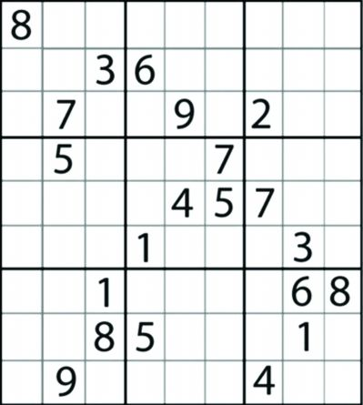

# 第6章 深度优先搜索


- **在图上寻找路径**

<div  style="width:450px; margin:0 auto;"></div>

在图上如何寻找从1到8的路径？

一种策略：只要能发现没走过的点，就走到它。有多个点可走就随便挑一个，如果无路可走就回退，再看有没有没走过的点可走。

- 运气好：[1] -> [2] -> [4] -> [8]
- 运气一般：[1] -> [2] -> [4] -> [5] -> [6] -> [8]
- 运气坏：[1] -> [3] -> [7] -> [9] => [7]  => [3] -> [5] -> [6] -> [8]（双线箭头表示回退）

<div  style="width:450px; margin:0 auto;"></div>

不连通的图，无法从节点1走到节点8。

完整的尝试过程可能为：[1] -> [2] -> [4] -> [3] -> [7] => [3] => [4] => [2] -> [9] => [2] => [1]

结论：不存在从1到8的路径。得出这个结论之前，一定会把从1出发能走到的点全部都走过。

从起点出发，走过的点要做标记，发现有没走过的点，就随意挑一个往前走，走不了就回退，此种路径搜索策略就称为“深度优先搜索”，简称“深搜”。

其实称为“远度优先搜索”更容易理解些。因为这种策略能往前走一步就往前走一步，总是试图走得更远。所谓远近(或深度），就是以距离起点的步数来衡量的。

- **判断从V出发是否能走到终点**

``` cpp
bool Dfs(V) {
    if(V为终点)
        return true;

    将V标记为旧点;
    对和V相邻的每个新节点U {
        if(Dfs(U) == true)
            return true;
    }
    return false;
}

int main(void) {
    将所有点都标记为新点;
    起点 = 1;
    终点 = 8;
    printf("%s\n", Dfs(起点) ? "Yes" : "No");
    
    return 0;
}
```

- **判断从V出发是否能走到终点，如果能输出路径**

``` cpp
Node path[MAX_LEN]; // MAX_LEN取节点总数即可
int depth;

bool Dfs(V) {
    if(V为终点) {
        path[depth] = V;
        return true;
    }

    将V标记为旧点;
    path[depth] = V;
    ++depth;
    对和V相邻的每个新节点U {
        if(Dfs(U) == true)
            return true;
    }
    --depth;
    return false;
}

int main(void) {
    将所有点都标记为新点;
    depth = 0;
    if(Dfs(起点)) {
        for(int i = 0;i <= depth; ++ i)
            printf("%d\n", path[i]);
    }
    return 0;
}
```

- **遍历图上所有节点**

``` cpp
Dfs(V) {
    将V标记为旧点;
    对和V相邻的每个新点U {
        Dfs(U);
    }
}

int main(void) {
    将所有点都标记为新点;
    while(在图中能找到新点k)
        Dfs(k);
}
```

- **图的表示方法 -- 邻接矩阵**

用一个二维数组$$G$$存放图，$$G[i][j]$$表示节点$$i$$和节点$$j$$之间边的情况（如有无边，边方向，权值大小等) 。

遍历复杂度：$$O(n^2)$$。 （$$n$$为节点数目）


- **图的表示方法 -- 邻接表**

每个节点$$V$$对应一个一维数组（vector），里面存放从$$V$$连出去的边，边的信息包括另一顶点，还可能包含边权值等。

遍历复杂度：$$O(n+e)$$。 （$$n$$为节点数目，$$e$$为边数目）

<div  style="width:450px; margin:0 auto;"></div>


## 6.1 城堡问题

**[题面]**

```
     1   2   3   4   5   6   7  
   #############################
 1 #   |   #   |   #   |   |   #
   #####---#####---#---#####---#
 2 #   #   |   #   #   #   #   #
   #---#####---#####---#####---#
 3 #   |   |   #   #   #   #   #
   #---#########---#####---#---#
 4 #   #   |   |   |   |   #   #
   #############################

   #  = Wall   
   |  = No wall
   -  = No wall
```

上图是一个城堡的地形图。请你编写一个程序，计算城堡一共有多少房间，最大的房间有多大。城堡被分割成 $$m \times n$$（$$m \leq 50$$，$$n \leq 50$$）个方块，每个方块可以有0~4面墙。

**[输入]**

程序从标准输入设备读入数据。第一行是两个整数，分别是南北向、东西向的方块数。在接下来的输入行里，每个方块用一个数字（$$0 \leq p \leq 50$$）描述。用一个数字表示方块周围的墙，1表示西墙，2表示北墙，4表示东墙，8表示南墙。每个方块用代表其周围墙的数字之和表示。城堡的内墙被计算两次，方块（1,1）的南墙同时也是方块（2,1）的北墙。输入的数据保证城堡至少有两个房间，数据保证城堡四周都是墙。

**[输出]**

城堡的房间数、城堡中最大房间所包括的方块数。结果显示在标准输出设备上。

**[样例输入]**

```
4 
7 
11 6 11 6 3 10 6 
7 9 6 13 5 15 5 
1 10 12 7 13 7 5 
13 11 10 8 10 12 13 
```

**[样例输出]**

```
5
9
```

**[思路]**

把方块看作是节点，相邻两个方块之间如果没有墙，则在方块之间连一条边，这样城堡就能转换成一个图。

求房间个数，实际上就是在求图中有多少个极大连通子图。

一个连通子图，往里头加任何一个图里的其他点，就会变得不连通，那么这个连通子图就是
极大连通子图。

对每一个房间，深度优先搜索，从而给这个房间能够到达的所有位置染色。最后统计一共用了几种颜色，以及每种颜色的数量。

如题目描述示例中，图完色可知一共有5个房间，最大的房间（1）占据9个格子。


```
#############################
# 1 | 1 # 2 | 2 # 3 | 3 | 3 #
#####---#####---#---#####---#
# 1 # 1 | 1 # 2 # 3 # 4 # 3 #
#---#####---#####---#####---#
# 1 | 1 | 1 # 5 # 3 # 5 # 3 #
#---#########---#####---#---#
# 1 # 5 | 5 | 5 | 5 | 5 # 3 #
#############################
```


**[参考代码]**

``` cpp
#include <stdio.h>

int R,C; // 行列数
int rooms[60][60];
int color[60][60] = {0};
int maxRoomArea = 0, roomNum = 0;
int totalRoomArea;

void dfs(int i, int j) {
    if(color[i][j]) return;

    ++totalRoomArea;
    color[i][j] = roomNum;
    if(!(rooms[i][j]&1)) dfs(i, j-1); // 向西
    if(!(rooms[i][j]&2)) dfs(i-1, j); // 向北
    if(!(rooms[i][j]&4)) dfs(i, j+1); // 向东
    if(!(rooms[i][j]&8)) dfs(i+1, j); // 向南
}

int main(void) {
    scanf("%d%d", &R, &C);
    for(int i=1; i<=R; ++i)
        for(int j=1; j<=C; ++j)
            scanf("%d", &rooms[i][j]);

    for(int i=1; i<=R; ++i) {
        for(int j=1; j<=C; ++j) {
            if(!color[i][j]) {
                ++roomNum ; 
                totalRoomArea = 0;
                dfs(i,j);
                maxRoomArea = totalRoomArea>maxRoomArea 
                    ? totalRoomArea : maxRoomArea;
            }
        }
    }
    printf("%d\n", roomNum);
    printf("%d\n", maxRoomArea);
}
```


## 6.2 踩方格

**[题面]**

有一个方格矩阵，矩阵边界在无穷远处。我们做如下假设：

- a. 每走一步时，只能从当前方格移动一格，走到某个相邻的方格上；
- b. 走过的格子立即塌陷无法再走第二次；
- c. 只能向北、东、西三个方向走；

请问：如果允许在方格矩阵上走 $$n$$ 步，共有多少种不同的方案。2种走法只要有一步不一样，即被认为是不同的方案。

**[输入]**

允许在方格上行走的步数 $$n$$（$$n \leq 20$$）

**[输出]**

计算出的方案数量。

**[样例输入]**

```
2
```

**[样例输出]**

```
7
```

**[思路]**

递归从(i,j) 出发，走n步的方案数，等于以下三项之和：

1. 从(i+1,j)出发，走n-1步的方案数。前提：(i+1,j)还没走过

2. 从(i,j+1)出发，走n-1步的方案数。前提：(i,j+1)还没走过

3. 从(i,j-1)出发，走n-1步的方案数。前提：(i,j-1)还没走过

**[参考代码]**

``` cpp
#include <stdio.h>

int visited[30][50] = {0};

int ways(int i, int j, int n) {
    if( n == 0)
        return 1;

    int num = 0;
    visited[i][j] = 1;
    if(!visited[i][j-1])
        num += ways(i, j-1, n-1);
    if(!visited[i][j+1])
        num += ways(i, j+1, n-1);
    if(!visited[i+1][j])
        num += ways(i+1, j, n-1);
    visited[i][j] = 0;
    return num;
}


int main(void) {
    int n;
    scanf("%d", &n);
    printf("%d\n", ways(0,25,n));
    return 0;
}
```

## 6.3 古代象形文字

**[题面]**

人类为了了解早期文明，考古学家经常研究古代语言书写的文本。其中有一种语言是在3000多年前古埃及使用的象形文字。下图中显示了六个象形文字及其名称。需要你编写一个程序来识别这六个字。

<div  style="width:350px; margin:0 auto;"></div>

**[输入]**

每组数据包含一个 $$H$$ 行 $$W$$ 列的字符矩阵（$$H \leq 200,  \; W \leq 50$$），每个字符为4个相邻像素点的十六进制（例如，10011100 对应的字符就是 9c）。转化为二进制后 $$1$$ 表示黑点，$$0$$ 表示白点。

输入满足：

- 不会出现上述6种符号之外的其它字符。
- 输入至少包含一个符号，且每个黑像素都属于一个符号。
- 每个符号都是一个四连块，并且不同符号不会相互接触，也不会相互包含。
- 如果两个黑像素有公共顶点，则它们一定有一个相同的相邻黑像素（有公共边）。
- 符号的形状一定和上图中的图形拓扑等价（可以随意拉伸但不能拉断）。

输入 两个 0 时表示输入结束。

**[输出]**

对于每个测试用例，输出"Case N: "，N为用例号，后面接在图像中识别出的象形文字组成的字符串，每个象形文字只输出一个代表其含义的字母。

- Ankh : A
- Wedjat : J
- Djed : D
- Scarab : S
- Was : W
- Akhet : K

每个输出字符串中字符按字典序排序。例如下图输出 AKW 。

<div  style="width:100px; margin:0 auto;"></div>

下图输出 AAAAA 。

<div  style="width:100px; margin:0 auto;"></div>

**[样例输入]**

```
100 25
0000000000000000000000000
0000000000000000000000000
...(50 lines omitted)...
00001fe0000000000007c0000
00003fe0000000000007c0000
...(44 lines omitted)...
0000000000000000000000000
0000000000000000000000000
150 38
00000000000000000000000000000000000000
00000000000000000000000000000000000000
...(75 lines omitted)...
0000000003fffffffffffffffff00000000000
0000000003fffffffffffffffff00000000000
...(69 lines omitted)...
00000000000000000000000000000000000000
00000000000000000000000000000000000000
0 0
```

本章最后准备了本题的测试数据。

**[样例输出]**

```
Case 1: AKW
Case 2: AAAAA
```

**[思路]**

根据题意，需要寻找在“随意拉伸”时还不会改变的“特征量”，通过计算和比较“特征量”完成识别。

题目说过，每个符号都是一个四连块，即所有黑点都连在一起，而中间有一些白色的“洞”。数一数就能发现，题目表中的6个符号从左到右依次有1，3，5，4，0，2个洞，各不相同。这样，只需要数一数输入的符号有几个“白洞”，就能准确地知道它是哪个符号了。

**[参考代码]**

``` cpp
#include <stdio.h>
#include <ctype.h>
#include <iostream>
#include <algorithm>
 
using namespace std;
 
int H, W;
int pic[210][210];  // 存储图片信息数组
int cnt = 0;        // 象形文字个数
int ans[50];        // ans[i] 表示第i个象形文字内部洞的数量
// id[i] 表示i个洞的象形文字对应的字母
char id[6] = {'W', 'A', 'K', 'J', 'S', 'D'};
 
// 预处理，将象形文字外面的像素全置为-1 
void dfs_pre(int i, int j) {		
	if(i<0 || i>=H || j<0 || j>=4*W) 
        return;

    if(pic[i][j] == 0) {
		pic[i][j] = -1;
		dfs_pre(i-1, j); 
        dfs_pre(i+1, j);
		dfs_pre(i, j-1); 
        dfs_pre(i, j+1);
	}
}
 
// dfs 象形文字内部空白区域
void dfs2(int i, int j) {			
	if(i<0 || i>=H || j<0 || j>=4*W) 
        return;
	
    if(pic[i][j] == 0) {
		pic[i][j] = -1;
		dfs2(i-1, j); 
        dfs2(i+1, j);
		dfs2(i, j-1); 
        dfs2(i, j+1);
	}
}

// dfs 象形文字线条本身，count表示第几个象形文字
void dfs1(int i, int j, int count) {	
	if(i<0 || i>=H || j<0 || j>=4*W) 
        return;

	// 遇到外部边界或者已经处理过
    if (pic[i][j] == -1) 
        return;	
    // 遇到象形文字本身
	else if(pic[i][j] == 1) {		
		pic[i][j] = -1;
		dfs1(i-1, j, count); 
        dfs1(i+1, j, count);
		dfs1(i, j-1, count); 
        dfs1(i, j+1, count);
	}
    // 遇到象形文字内部
	else if (pic[i][j] == 0) {	
        // 记录象形文字内部洞个数
		ans[count]++;
		dfs2(i, j);
	}
}
 
int main(void) {
	int kase = 0;
    while(~scanf("%d%d", &H, &W) && H && W) {

        // 初始化数组
		fill(ans, ans+50, 0);
        // 初始化象形文字个数
		cnt = 0;

		// 读取数据，并将十六进制还原成1/0
		for(int i=0; i<H; ++i) {
            char s[100];
            cin >> s;
			for(int j=0; j<W; ++j) {
				char c;	
                int t;
                sscanf(s+j, "%c", &c);
				if(isdigit(c))  t = c-'0'; 
                else  t = c-'a'+10;

				pic[i][j*4] = t >> 3 & 1;
				pic[i][j*4+1] = t >> 2 & 1;
				pic[i][j*4+2] = t >> 1 & 1;
				pic[i][j*4+3] = t & 1;
			}
        }

		// 预处理，将象形文字外部的像素置为-1
		for(int i=0; i<H; ++i) {
			if(pic[i][0] == 0) 
                dfs_pre(i, 0);
			if(pic[i][4*W-1] == 0) 
                dfs_pre(i, 4*W-1);
		}
		for(int i=0; i<4*W; ++i) {
			if(pic[0][i]==0) 
                dfs_pre(0, i);
			if(pic[H-1][i] == 0) 
                dfs_pre(H-1, i);
		}

		// 统计象形文字个数和每个象形文字内部洞的个数
		for(int i=0; i<H; ++i)
			for(int j=0; j<4*W; ++j) 
				if(pic[i][j] == 1)  
					dfs1(i, j, ++cnt);

        char str[1000] = "";
		for(int i=0; i<cnt; ++i)
            str[i] = id[ans[i+1]];
        sort(str, str+cnt);

        printf("Case %d: %s\n", ++kase, str);
	}
	return 0;
}
```

## 6.4 数独游戏

**[题面]**

数独是一种运用纸、笔进行演算的逻辑游戏。玩家需要根据9×9盘面上的已知数字，推理出所有剩余空格的数字，并满足每一行、每一列、每一个3\*3宫内的数字均含1-9，不重复。 每一道合格的数独谜题都有且仅有唯一答案，推理方法也以此为基础，任何无解或多解的题目都是不合格的。

芬兰一位数学家号称设计出全球最难的“数独游戏”，并刊登在报纸上，让大家去挑战。这位数学家说，他相信只有“智慧最顶尖”的人才有可能破解这个“数独之谜”，但对会使用计算机编程的你来说，恐怕易如反掌了。

<div  style="width:200px; margin:0 auto;"></div>

本题的要求就是输入数独题目，程序输出数独的唯一解。

**[输入]**

第一行有一个数 $$n$$（$$0 < n < 100$$），表示有 $$n$$ 组测试数据，每组测试数据是由一个9*9的九宫格构成，$$0$$表示对应的格子为空。

**[输出]**

针对每组样例，输出9行，每行9个数字表示数独的解，中间不需要添加其它字符。

**[样例输入]**

```
1
800000000
003600000
070090200
050007000
000045700
000100030
001000068
008500010
090000400
```

**[样例输出]**

```
812753649
943682175
675491283
154237896
369845721
287169534
521974368
438526917
796318452
```

**[思路]**

从左上角开始，通过对每一个没有填数的格子进行1到9的遍历，然后通过约束函数来判断该该格子的填数是否符合规则，若符合就递进到下一个（即右边的格子），假若下一个格子已超出右边界，则递进到下一行的第0个格子处，依此类推，直到填完最后一个格子即完成数独的解！

**[参考代码]**

``` cpp
#include <iostream>
#include <string.h>
#include <stdio.h>
using namespace std;

int p[9][9];
int fag = 0;

// 打印答案
void print_ans() {
	for(int i=0; i<9; ++i) {
		for(int j=0; j<9; ++j)
			printf("%d", p[i][j]);
		printf("\n");
	}
}

// 判断数字k是否能放在(x,y)位置 0:不能 1:能
int judge(int x, int y, int k) {
    // 判断在大矩形里垂直水平是否重复
	for(int i=0; i<9; ++i) {
		if(p[i][y]==k || p[x][i]==k) 
            return 0;
	}
    // 所在的小矩形区域
	int x1 = x/3*3;
	int y1 = y/3*3;
    // 判断在小矩形里行列是否重复
	for(int i=x1; i<x1+3; ++i) {
		for(int j=y1; j<y1+3; ++j) {
			if(p[i][j] == k)
			    return 0;
		}
	}

	return 1;
}

void dfs(int x, int y) {
    // dfs到最后一格，输出答案
	if(x==9 && y==0) {
		print_ans();
		fag=1;
		return; 
	}

    // 当前位置已有数字
	if(p[x][y] != 0) {
        // 判断是否需要换行
		if(y == 8) 
            dfs(x+1, 0);
		else 
            dfs(x, y+1);
	}
    // 当前位置没有数字
	else {
		for(int i=1; i<=9; ++i) {
		    if(judge(x, y, i)) {
		    	p[x][y] = i;

		    	if(y == 8) 
                    dfs(x+1, 0);
				else 
                    dfs(x, y+1);
				
				if(fag == 1) return;

				p[x][y] = 0; // 回归初始状态
			}
	    }
	}
}

int main(void) {
	int t;
	scanf("%d", &t);
	while(t--) {
        // 多组数据输入，初始化操作
		memset(p, 0, sizeof(p));
        char line[20];

		for(int i=0; i<9; ++i) {
            cin >> line;
			for(int j=0; j<9; ++j)
				p[i][j] = line[j]-'0';
		}

        // 判断是否继续dfs
		fag = 0;

		dfs(0, 0);
	}

	return 0;
} 
```

## 6.5 困难的串

**[题面]**

如果一个字符串包含两个相邻的重复子串，则称它是”容易的串“，其他串成为”困难的串“。

例如："BB"，"ABCDACABCAB"，"ABCDABCD"都是”容易的串“，"D"，"DC"，"ABDAB"，"CBABCBA"都是”困难的串“。

**[输入]**

本题有多组测试用例。输入正整数 $$n$$，$$L$$。表示要输出由前 $$L$$ 个字符（大写英文字母）组成的，字典序第 $$n$$ 小的“困难的串”（字典序）。

例如对于 $$L = 3$$，前 $$n = 7$$ 个”困难的串“为：

```
A 
AB 
ABA 
ABAC 
ABACA 
ABACAB
ABACABA 
```

输入两个0时表示终止。

**[输出]**

由于每个串都可能很长（串最大长度80），请将其分为4个字符一组，每组字符使用空格隔开。如果当前用例输出字符组超过16个，在新的一行输出第17组字符。

“困难的串”输出完后在新的一行输出“困难的串”的长度。

因此对于 $$L = 3$$，$$n = 7$$ 输出为：

```
ABAC ABA
7
```


**[样例输入]**

```
30 3
0 0
```

**[样例输出]**

```
ABAC ABCA CBAB CABA CABC ACBA CABA
28
```

**[思路]**

根据题意可知，“困难的串”去掉最后一个字符之后，也必然是一个“困难的串”。只需在“困难的串”末尾尝试加入一个字符，然后判断其是否为“困难的串”即可。

此外在判断“困难的串”时，根据前面分析，则只需要判断最后一个字符所在子串即可。

**[参考代码]**

``` cpp
#include <stdio.h>
#include <string.h>

int N, L;
int cnt;

int is_hard(char * s) {
    char temp[100];
    int len = strlen(s);
    for(int i=1; i<=len/2; ++i) {
            memcpy(temp, s+len-2*i, i);
            temp[i] = '\0';
            if(!strcmp(temp, s+len-i))
                return 0;
    }
    return 1;
}

void dfs(char * str) {
    int len = strlen(str);
    for(char c='A'; c<'A'+L && cnt<N; ++c) {
        str[len] = c;
        str[len+1] = '\0';
        if(!is_hard(str))
            continue;

        if(++cnt == N)
            return;

        dfs(str);
    }
}

int main(void) {
    char str[100] = "";
    while(~scanf("%d %d", &N, &L) && (N || L)) {

        memset(str, 0, sizeof(str));
        cnt = 0;

        dfs(str);

        int len = strlen(str), i;
        for(i=0; i<len; ++i) {
            printf("%c", str[i]);
            if(i==63) printf("\n");
            else if(i%4==3 && i!=len-1) printf(" ");
        }
        if(i!=64) printf("\n");
        printf("%d\n", len);
    }
 
    return 0;
}
```


## 6.6 ROADS

**[题面]**

编号为$$1$$到$$N$$的$$N$$个城市通过单向道路连接。每条道路都有两个属性：道路长度和道路通行费。

Bob和Alice共同居住在城市$$1$$，当发现Alice在他们喜欢的纸牌游戏中作弊后，Bob决定与她分手，并想要尽快的搬到城市$$N$$，不过他现在非常的缺钱。

我们需要帮助Bob找到城市$$1$$到城市$$N$$的最短路径，并且在他能够负担的起的范围内。

**[输入]**

第一行输入包含一个整数$$K$$，$$0 \leq K \leq 10000$$，表示Bob可以花费的最大钱数。

第二行包含一个整数$$N$$，$$2 \leq N \leq 100$$，表示城市的数量。

第三行包含一个整数$$R$$，$$1 \leq R \leq 10000$$，表示道路的数量。

接下来$$R$$行是通过空格隔开的整数$$S$$，$$D$$，$$L$$和$$T$$，用来描述一条道路：
$$S$$表示道路的起点城市，$$1 \leq S \leq N$$。
$$D$$表示道路的目的城市，$$1 \leq D \leq N$$。
$$L$$表示道路的长度，$$1 \leq L \leq 100$$。
$$T$$表示道路的通行费，$$0 \leq T \leq 100$$。

请注意，不同的道路可能具有相同的起点城市和目的城市。

**[输出]**

输出一行包含一个整数，表示从城市$$1$$到城市$$N$$的最短路径长度，其通行费应小于或等于$$K$$。

如果满足要求的路径不存在，则输出-1。

**[样例输入]**

```
5
6
7
1 2 2 3
2 4 3 3
3 4 2 4
1 3 4 1
4 6 2 1
3 5 2 0
5 4 3 2
```

**[样例输出]**

```
11
```

**[思路]**

从城市$$1$$开始深度优先遍历整个图，找到所有能过到达城市$$N$$的走法，选一个最优的。

根据思路写完程序，在OJ提交时结果却显示超时，此时需要对搜索算法进行剪枝。[题目链接](http://poj.org/problem?id=1724)

- 可行性剪枝：

  如果当前条件不合法就不再继续搜索，直接return。这是非常好理解的剪枝，搜索初学者都能轻松地掌握，而且也很好想。一般的搜索都会加上。

- 最优性剪枝：

  如果当前条件所创造出的答案必定比之前的答案大，那么剩下的搜索就毫无必要，甚至可以剪掉。

从本题来看：

1. 如果当前已经找到的最优路径长度为L ,那么在继续搜索的过程中，总长度已经大于等于L的走法，就可以直接放弃，不用走到底了。

2. 如果到达某个状态A时，发现前面曾经也到达过A，且前面那次到达A所花代价更少，则剪枝。这要求保存到达状态A的到目前为止的最少代价。
用midL\[k]\[m] 表示：走到城市k时总过路费为m的条件下，最优路径的长度。若在后续的搜索中，再次走到k时，如果总路费恰好为m，且此时的路径长度已经超过midL\[k]\[m]，则不必再走下去了。


**[参考代码]**

``` cpp
#include <stdio.h>
#include <vector>
#include <climits>
using namespace std;

struct Road {
    int e; // 道路终点
    int l; // 道路长度
    int t; // 道路花费
};

int K;  // 总钱数
int N;  // 城市数量
int R;  // 单向道路条数

int minLen = INT_MAX; // 最小长度
int totalLen = 0;     // 当前总长度
int totalCost = 0;    // 当前成本

// 记录城市是否走过的标识数组
int visited[110] = {0};    
// minL[i][j] 表示 从起点走到城市i时在总花费j的条件下，
// 起点到城市i目前的最优路径长度
int minL[110][10010];

// 记录道路信息的邻接表
vector<vector<Road>> adj(110);

void dfs(int s) {
    // 已经到达终点，记录最短路径长度
    if(s == N) {
        minLen = minLen<totalLen ? minLen : totalLen;
        return;
    }

    // 遍历城市s为起始地址的所有道路
    for(int i=0; i<adj[s].size(); ++i) {
        Road r = adj[s][i];
        // 目的城市已经走过
        if(visited[r.e]) continue;
        // 钱数不足到达目的城市
        if(totalCost + r.t > K) continue;
        // 到达目的城市的路径长度已经大于之前的最短路径
        if(totalLen + r.l >= minLen) continue;
        // 当前到达目的城市已经走过的路径长度大于之前到达目的城市
        // 走过的路径长度（在花费相同的情况下）
        if(totalLen + r.l >= minL[r.e][totalCost+r.t]) 
            continue;

        minL[r.e][totalCost+r.t] = totalLen + r.l;

        totalLen += r.l;
        totalCost += r.t;
        visited[r.e] = 1;
        dfs(r.e);
        totalLen -= r.l;
        totalCost -= r.t;
        visited[r.e] = 0;
    }
}

int main(void) {
    scanf("%d %d %d", &K, &N, &R);
    for(int i=0; i<R; ++i) {
        int s;
        scanf("%d", &s);
        Road r;
        scanf("%d %d %d", &r.e, &r.l, &r.t);
        if(r.e != s)
            adj[s].push_back(r);
    }
    
    for(int i=0; i<110; ++i)
        for(int j=0; j<10010; ++j)
            minL[i][j] = INT_MAX;

    visited[1] = 1;
    dfs(1);
    printf("%d\n", minLen<INT_MAX ? minLen : -1);

    return 0;
}
```

## 6.7 生日蛋糕

**[题面]**

7月17日是Mr.W的生日，ACM-THU为此要制作一个体积为 $$Nπ$$ 的 $$M$$ 层生日蛋糕，每层都是一个圆柱体。

设从下往上数第$$i$$（$$1 \leq i \leq M$$）层蛋糕是半径为 $$Ri$$ , 高度为 $$Hi$$ 的圆柱。当 $$i < M$$时，要求 $$Ri > Ri+1$$且$$Hi > Hi+1$$。

由于要在蛋糕上抹奶油，为尽可能节约经费，我们希望蛋糕外表面（最下一层的下底面除外）的面积 $$Q$$ 最小。

令 $$Q = Sπ$$ 。

请编程对给出的 $$N$$ 和 $$M$$ ，找出蛋糕的制作方案（适当的 $$Ri$$ 和 $$Hi$$ 的值），使 $$S$$ 最小。
（除 $$Q$$ 外，以上所有数据皆为正整数）

**[输入]**

有两行，第一行为 $$N$$（$$N \leq 10000$$），表示待制作的蛋糕的体积为 $$Nπ$$ ；第二行为$$M$$（$$M \leq 20$$），表示蛋糕的层数为 $$M$$ 。

**[输出]**

仅一行，是一个正整数 $$S$$（若无解则 $$S = 0$$）。

**[样例输入]**

```
100
2
```

**[样例输出]**

```
68
```

**[提示]**

圆柱公式

- 体积 $$V = πR^2H$$
- 侧面积 $$A' = 2πRH$$
- 底面积 $$A = πR^2$$

**[思路]**

**深度优先搜索，枚举什么？**

- 枚举每一层可能的高度和半径。

**如何确定搜索范围？**

- 底层蛋糕的最大可能半径和最大可能高度。

**搜索顺序，哪些地方体现搜索顺序？**

- 从底层往上搭蛋糕，而不是从顶层往下搭。

**如何剪枝？**

- 剪枝1：搭建过程中发现已建好的面积已经超过目前求得的最优表面积，或者预见到搭完后面积一定会超过目前最优表面积，则停止搭建。（最优性剪枝）
- 剪枝2：搭建过程中预见到再往上搭，高度已经无法安排，或者半径已经无法安排，则停止搭建。（可行性剪枝）
- 剪枝3：搭建过程中发现还没搭的那些层的体积，一定会超过还缺的体积，则停止搭建。（可行性剪枝）
- 剪枝4：搭建过程中发现还没搭的那些层的体积，最大也到不了还缺的体积，则停止搭建。（可行性剪枝）


**[参考代码]**

``` cpp
#include <stdio.h>
#include <math.h>
#include <limits.h>

int N, M;
int minArea = INT_MAX;
int totalArea;

// minSArr[i] : 第i层到第1层最小可能的侧面积和
int minSArr[25];
// minVArr[i] : 第i层到第1层最小可能的体积和
int minVArr[25];

void dfs(int v, int m, int r, int h) {
    if(m==0) {
        if(!v) 
            minArea = minArea<totalArea ? minArea : totalArea;
        return;
    }

    // [剪枝]所需填充体积小于0 
    if(v<=0) return;
    // [剪枝]当前表面积大于等于之前的最小表面积 
    if(totalArea>=minArea) return;
    // [剪枝]根据当前表面积搭完后表面积不会小于等于最小表面积 
    if(totalArea+minSArr[m] >= minArea) return;
    // [剪枝]根据当前体积搭完后总体积一定大于给定体积 
    if(minVArr[m] > v) return;
    // [剪枝]根据当前体积搭完后总体积一定小于给定体积 
    int sum=0;
    for(int i=r,j=h, k=m; k>0&&i>0&&j>0; --i,--j,--k)
        sum += i*i*j;
    if(sum < v) return;

    for(int rr=r; rr>=m; --rr) {
        if(m==M)
            totalArea = rr * rr;
        for(int hh=h; hh>=m; --hh) {
            totalArea += 2*rr*hh;
            dfs(v-rr*rr*hh, m-1, rr-1, hh-1);
            totalArea -= 2*rr*hh;
        }
    }
}

int main(void) {
    for(int i=1; i<25; ++i) {
        minSArr[i] = minSArr[i-1] + 2*i*i;
        minVArr[i] = minVArr[i-1] + i*i*i;
    }

    scanf("%d %d", &N, &M);

    int maxR = (int)sqrt((1.0*N-minVArr[M-1])/M);
    int maxH = (N-minVArr[M-1])/(M*M);

    dfs(N, M, maxR, maxH);

    if(minArea != INT_MAX)
        printf("%d\n", minArea);
    else
        printf("0\n");

    return 0;
}
```

## 6.3 古代象形文字 - 测试数据

**[样例输入]**

```
6 2
00
7c
44
7c
30
00
6 25
0000000000000000000000000
0000000000000000000000000
00001fe0000000000007c0000
00003fe0000000000007c0000
0000000000000000000000000
0000000000000000000000000
10 3
000
778
548
748
578
700
000
7f0
1e0
000
16 2
00
7e
42
7e
42
7e
42
7e
42
7e
42
7e
00
00
4a
00
16 1
0
1
3
2
8
e
f
5
7
6
4
c
d
9
b
a
9 2
00
7e
42
7e
42
7e
42
7e
00
43 2
00
7e
00
7e
42
7e
42
7e
42
7e
00
7e
42
7e
00
7e
42
7e
42
7e
00
7e
42
7e
42
7e
42
7e
42
7e
00
7e
42
7e
42
7e
42
7e
42
7e
42
7e
00
200 50
00000000000000000000000000000000000000000000000000
00000000000000000000000000000000000000000000000000
00000000000000000000000000000000000000000000000000
00000000000000000000000000000000000000000000000000
00000000000000000000000000000000000000000000000000
00000000000000000000000000000000000000000000000000
00000000000000000000000000000000000000000000000000
00000000000000000000000000000000000000000000000000
00000000000000000000000000000000000000000000000000
10000000000000000000000000000000000000000000000000
00000000000000000000000000000000000000000000000000
00000000000000000000000000000000000000000000000000
00000000000000000000000000000000000000000000000000
00000000000000000000000000000000000000000000000000
00000000000000000000000000000000000000000000000000
00000000000000000000000000000000000000000000000000
00000000000000000000000000000000000000000000000000
00000000000000000000000000000000000000000000000000
00000000000000000000000000000000000000000000000000
10000000000000000000000000000000000000000000000000
00000000000000000000000000000000000000000000000000
00000000000000000000000000000000000000000000000000
00000000000000000000000000000000000000000000000000
00000000000000000000000000000000000000000000000000
00000000000000000000000000000000000000000000000000
00000000000000000000000000000000000000000000000000
00000000000000000000000000000000000000000000000000
00000000000000000000000000000000000000000000000000
00000000000000000000000000000000000000000000000000
10000000000000000000000000000000000000000000000000
00000000000000000000000000000000000000000000000000
00000000000000000000000000000000000000000000000000
00000000000000000000000000000000000000000000000000
00000000000000000000000000000000000000000000000000
00000000000000000000000000000000000000000000000000
00000000000000000000000000000000000000000000000000
00000000000000000000000000000000000000000000000000
00000000000000000000000000000000000000000000000000
00000000000000000000000000000000000000000000000000
10000000000000000000000000000000000000000000000000
00000000000000000000000000000000000000000000000000
00000000000000000000000000000000000000000000000000
00000000000000000000000000000000000000000000000000
00000000000000000000000000000000000000000000000000
00000000000000000000000000000000000000000000000000
00000000000000000000000000000000000000000000000000
00000000000000000000000000000000000000000000000000
00000000000000000000000000000000000000000000000000
00000000000000000000000000000000000000000000000000
10000000000000000000000000000000000000000000000000
00000000000000000000000000000000000000000000000000
00000000000000000000000000000000000000000000000000
00000000000000000000000000000000000000000000000000
00000000000000000000000000000000000000000000000000
00000000000000000000000000000000000000000000000000
00000000000000000000000000000000000000000000000000
00000000000000000000000000000000000000000000000000
00000000000000000000000000000000000000000000000000
00000000000000000000000000000000000000000000000000
10000000000000000000000000000000000000000000000000
00000000000000000000000000000000000000000000000000
00000000000000000000000000000000000000000000000000
00000000000000000000000000000000000000000000000000
00000000000000000000000000000000000000000000000000
00000000000000000000000000000000000000000000000000
00000000000000000000000000000000000000000000000000
00000000000000000000000000000000000000000000000000
00000000000000000000000000000000000000000000000000
00000000000000000000000000000000000000000000000000
10000000000000000000000000000000000000000000000000
00000000000000000000000000000000000000000000000000
00000000000000000000000000000000000000000000000000
00000000000000000000000000000000000000000000000000
00000000000000000000000000000000000000000000000000
00000000000000000000000000000000000000000000000000
00000000000000000000000000000000000000000000000000
00000000000000000000000000000000000000000000000000
00000000000000000000000000000000000000000000000000
00000000000000000000000000000000000000000000000000
10000000000000000000000000000000000000000000000000
00000000000000000000000000000000000000000000000000
00000000000000000000000000000000000000000000000000
00000000000000000000000000000000000000000000000000
00000000000000000000000000000000000000000000000000
00000000000000000000000000000000000000000000000000
00000000000000000000000000000000000000000000000000
00000000000000000000000000000000000000000000000000
00000000000000000000000000000000000000000000000000
00000000000000000000000000000000000000000000000000
10000000000000000000000000000000000000000000000000
00000000000000000000000000000000000000000000000000
00000000000000000000000000000000000000000000000000
00000000000000000000000000000000000000000000000000
00000000000000000000000000000000000000000000000000
00000000000000000000000000000000000000000000000000
00000000000000000000000000000000000000000000000000
00000000000000000000000000000000000000000000000000
00000000000000000000000000000000000000000000000000
00000000000000000000000000000000000000000000000000
10000000000000000000000000000000000000000000000000
00000000000000000000000000000000000000000000000000
00000000000000000000000000000000000000000000000000
00000000000000000000000000000000000000000000000000
00000000000000000000000000000000000000000000000000
00000000000000000000000000000000000000000000000000
00000000000000000000000000000000000000000000000000
00000000000000000000000000000000000000000000000000
00000000000000000000000000000000000000000000000000
00000000000000000000000000000000000000000000000000
10000000000000000000000000000000000000000000000000
00000000000000000000000000000000000000000000000000
00000000000000000000000000000000000000000000000000
00000000000000000000000000000000000000000000000000
00000000000000000000000000000000000000000000000000
00000000000000000000000000000000000000000000000000
00000000000000000000000000000000000000000000000000
00000000000000000000000000000000000000000000000000
00000000000000000000000000000000000000000000000000
00000000000000000000000000000000000000000000000000
10000000000000000000000000000000000000000000000000
00000000000000000000000000000000000000000000000000
00000000000000000000000000000000000000000000000000
00000000000000000000000000000000000000000000000000
00000000000000000000000000000000000000000000000000
00000000000000000000000000000000000000000000000000
00000000000000000000000000000000000000000000000000
00000000000000000000000000000000000000000000000000
00000000000000000000000000000000000000000000000000
00000000000000000000000000000000000000000000000000
10000000000000000000000000000000000000000000000000
00000000000000000000000000000000000000000000000000
00000000000000000000000000000000000000000000000000
00000000000000000000000000000000000000000000000000
00000000000000000000000000000000000000000000000000
00000000000000000000000000000000000000000000000000
00000000000000000000000000000000000000000000000000
00000000000000000000000000000000000000000000000000
00000000000000000000000000000000000000000000000000
00000000000000000000000000000000000000000000000000
10000000000000000000000000000000000000000000000000
00000000000000000000000000000000000000000000000000
00000000000000000000000000000000000000000000000000
00000000000000000000000000000000000000000000000000
00000000000000000000000000000000000000000000000000
00000000000000000000000000000000000000000000000000
00000000000000000000000000000000000000000000000000
00000000000000000000000000000000000000000000000000
00000000000000000000000000000000000000000000000000
00000000000000000000000000000000000000000000000000
10000000000000000000000000000000000000000000000000
00000000000000000000000000000000000000000000000000
00000000000000000000000000000000000000000000000000
00000000000000000000000000000000000000000000000000
00000000000000000000000000000000000000000000000000
00000000000000000000000000000000000000000000000000
00000000000000000000000000000000000000000000000000
00000000000000000000000000000000000000000000000000
00000000000000000000000000000000000000000000000000
00000000000000000000000000000000000000000000000000
10000000000000000000000000000000000000000000000000
00000000000000000000000000000000000000000000000000
00000000000000000000000000000000000000000000000000
00000000000000000000000000000000000000000000000000
00000000000000000000000000000000000000000000000000
00000000000000000000000000000000000000000000000000
00000000000000000000000000000000000000000000000000
00000000000000000000000000000000000000000000000000
00000000000000000000000000000000000000000000000000
00000000000000000000000000000000000000000000000000
10000000000000000000000000000000000000000000000000
00000000000000000000000000000000000000000000000000
00000000000000000000000000000000000000000000000000
00000000000000000000000000000000000000000000000000
00000000000000000000000000000000000000000000000000
00000000000000000000000000000000000000000000000000
00000000000000000000000000000000000000000000000000
00000000000000000000000000000000000000000000000000
00000000000000000000000000000000000000000000000000
00000000000000000000000000000000000000000000000000
10000000000000000000000000000000000000000000000000
00000000000000000000000000000000000000000000000000
00000000000000000000000000000000000000000000000000
00000000000000000000000000000000000000000000000000
00000000000000000000000000000000000000000000000000
00000000000000000000000000000000000000000000000000
00000000000000000000000000000000000000000000000000
00000000000000000000000000000000000000000000000000
00000000000000000000000000000000000000000000000000
00000000000000000000000000000000000000000000000000
10000000000000000000000000000000000000000000000000
00000000000000000000000000000000000000000000000000
00000000000000000000000000000000000000000000000000
00000000000000000000000000000000000000000000000000
00000000000000000000000000000000000000000000000000
00000000000000000000000000000000000000000000000000
00000000000000000000000000000000000000000000000000
00000000000000000000000000000000000000000000000000
00000000000000000000000000000000000000000000000000
00000000000000000000000000000000000000000000000000
10000000000000000000000000000000000000000000000000
100 25
0000000000000000000000000
0000000000000000000000000
0000000000000000000000000
0000000000000000000000000
0000000000000000000000000
0000000000000000000000000
0000000000000000000000000
0000000000000000000000000
0000000000000000000000000
00000f8000000000000000000
00001fe000000000000000000
00007ff000000000000000000
00007ff800000000000000000
0000f8f800000000000000000
0001f07c00000000000000000
0001e03c00000000001800000
0001e01c00000000003c00000
0001c01c00000000007c00000
0003c01e0000000000f800000
0003c01e0000000001f000000
0001c01c0000000003f000000
0001c01c0000000007e000000
0001e01c000000000fc000000
0001e03c000000001fc000000
0000e03c000000001fc000000
0000f038000000003ff000000
0000f078000000003ff800000
00007870000000007ff800000
000038f0000000007cfc00000
00003ce0000000007c7c00000
00781fc0f0000000f87c00000
007ffffff0000000f07c00000
007ffffff0000000f07c00000
007ffffff0000001f07c00000
007ffffff0000000e03e00000
007fcf81f0000000603e00000
00000f8000000000003e00000
00000f8000000000003e00000
00000f8000000000003e00000
00000f8000000000001e00000
00000f8000000000001f00000
00000fc000000000001f00000
00000fc000000000001f00000
00000fc000000000001f00000
00000fc000000000000f00000
00001fc000000000000f80000
00001fc000000000000f80000
00001fc000000000000f80000
00001fc000000000000f80000
00001fe000000000000f80000
00001fe000000000000780000
00001fe0000000000007c0000
00001fe0000000000007c0000
00003fe0000000000007c0000
00003fe0000000000007c0000
00003fe0000000000007c0000
00003fe0000c00000003c0000
00000000003ff0000003c0000
00000000007ff8000003e0000
0000000001fffc000003e0000
0000000003e03f000003e0000
0000000007c00f000003e0000
000000000f0003800003f0000
000000000e0001c00003fc000
000000001c0001e00007fe000
000000003c0000e0000fff000
000000073c000070000fdf000
0000001ff8000070001f0f800
0000001ff8000070001e07800
0000003cf0000078001e03800
0000003870000033001e03800
000000307800003fc01e03800
000000703800007fe00e03800
000000703800007ce00e03800
000000703c000078700703800
000000701e0000f0700701000
000000701e0000e0700300000
000000700f0001c0700000000
0000006007800380600000000
000000e003e00700600000000
000000e001fe7e00600000000
000000e000fffc00e00000000
000000e0000ff000e00000000
000000f800038000e00000000
000000fff0000000e00000000
000000fffff00000e00000000
00000003ffffe000c00000000
0000000007ffffc0c00000000
000000000007ffffc00000000
0000000000000fffc00000000
000000000000001fc00000000
0000000000000000000000000
0000000000000000000000000
0000000000000000000000000
0000000000000000000000000
0000000000000000000000000
0000000000000000000000000
0000000000000000000000000
0000000000000000000000000
0000000000000000000000000
150 38
00000000000000000000000000000000000000
00000000000000000000000000000000000000
00000000000000000000000000000000000000
00000000000000000000000000000000000000
00000000000000000000000000000000000000
00000000000000000000000000000000000000
00000000000000000000000000000000000000
00000000000000000000000000000000000000
00000000000000000000000000003000000000
00000f80000000001fff000000007800000000
00001fe0000000007fff80000000ff00000000
00007ff000000000ffffe0000001ff80000000
00007ff800000003fffff0000001fffc000000
0000f8f800000007fffffc000001fffe000000
0001f07c0000000ffffffe000000ffff000000
0001e03c0000001fffffff000000ffff800000
0001e01c0000003fffffff0000007fffc00000
0001c01c0000003fffffff8000007fefc00000
0003c01e0000007fffffffc000003f83c00000
0003c01e000000ffffffffc000001f81e00000
0001c01c000000fffc0fffe000001f01e00000
0001c01c000001fff003ffe000000f01e00000
0001e01c000001ffe001fff000000f00e00000
0001e03c000003ffc0007ff000001e00f00000
0000e03c000003ff80007ff800001e00f00000
0000f038000007ff80003ff800001e00f00000
0000f078000007ff00003ff800001e00f00000
00007870000007ff00001ffc00000e00e00000
000038f000000fff00001ffc00000e00e00000
00003ce000000ffe00000ffc00000e00e00000
00781fc0f0000ffe00000ffc00000f00e00000
007ffffff0000ffc00000ffc00000f01e00000
007ffffff0000ffc00000ffc00000f01e00000
007ffffff0000ffc00000ffc00000701c00000
007ffffff0000ffc00000ffc00000781c00000
007fcf81f0000ffc000007fc00000783c00000
00000f8000000ffc000007fc00000383800000
00000f8000000ffc000007fc000003c7800000
00000f8000000ffc000007fc000001c7800000
00000f8000000ffc000007fc000001e7000000
00000f8000000ffc000007fc000200ef008000
00000fc000000ffc00000ffc0003f8fe3f8000
00000fc000000ffc00000ffc0003ffffff8000
00000fc000000ffc00000ffc0003ffffff8000
00000fc000000ffc00000ffc0003ffffff8000
00001fc000000ffc00000ffc0003ffffff8000
00001fc0000007fe00000ff80003ffffff8000
00001fc0000007fe00000ff80003fffdff8000
00001fc0000007fe00000ff80003c03c000000
00001fe0000007ff00001ff80000007c000000
00001fe0000003ff00001ff00000007c000000
00001fe0000003ff00001ff00000007c000000
00001fe0000001ff80003ff00000007c000000
00003fe0000001ff80003fe00000007c000000
00003fe0000001ff80003fe00000007c000000
00003fe0000000ffc0007fe00000007c000000
00003fe0000000ffc0007fc00000007c000000
000000000000007fe0007fc00000007c000000
000000000000007fe000ff800000007c000000
000000000000007ff001ff800000007c000000
000000000000003ff001ff800000007c000000
000000000000001ff803ff000000007c002000
000000000000001ff803ff000000007c006000
000000000000000ffc07fe000000007c006000
000000000000000ffc0ffc000000007c00c000
000000000000000ffe0ffc000000003e01c000
0000000000000007ff0ff8000000003f03c000
0000000000000003ff1ff0000000003f8f8000
0000000003c00001ffbff00000f0001fff8000
0000000003ffc001ffffe0007ff0000fff8000
0000000003fffff1ffffe3fffff00007ff8000
0000000003fffffffffffffffff00001ff0000
0000000003fffffffffffffffff00000ff0000
0000000003fffffffffffffffff000007f0000
0000000003fffffffffffffffff000001e0000
0000000003fffffffffffffffff000000e0000
0000000003fffffffffffffffff00000020000
0000000003fffffffffffffffff00000000000
0000000003fffffffffffffffff00000000000
0000000003fffffffffffffffff00000000000
0000000003fffffffffffffffff00000000000
0000000003fffffffffffffffff00000000000
0000000003fffffffffffffffff00000000000
0000000003fffffc1ffe0007fff00000000000
0000000003ff80000ffe000000f00000000000
00000000038000000ffe000000000000000000
00000000000000001fff000000000000000000
00000000000000001fff000000000000000000
00000000000000001fff000000000000000000
00000000000000001fff000000000000000000
00000000000000001fff000000000000000000
00000000000000001fff000000000000000000
00000000000000003fff000000000000000000
00000000000000003fff000000000000000000
00000000000000003fff0000000fc000000000
000000000fe000003fff8000003ff000000000
000000003ffc00003fff8000007ffc00000000
00000000fffe00003fff800000fcfc00000000
00000001f01f00003fff800001f03e00000000
00000003e00f80003fff800003e01f00000000
00000003e00780003fff800003e00f00000000
00000003e00780003fff800003c00f00000000
00000003e00f80003fff800003c00f00000000
00000001f00f00007fff800003c00f00000000
00000000f81e00007fffc00003e00f00000000
000000007c3c00007fffc00001e01e00000000
000000003e7800007fffc00000f01e00000000
000000fffffffe007fffc00000f03c00000000
000000fffffffe007fffc00000787800000000
000000fffffffe007fffc000003cf000000000
0000000007c000007fffe000f81fe07c000000
0000000007e000007fffe000fffffffc000000
0000000007e000007fffe000fffffffc000000
000000000fe000007fffe000fffffffc000000
000000000ff00000ffffe000ffc7c0fc000000
000000000ff00000ffffe0000007c000000000
000000001ff00000ffffe000000fc000000000
000000001ff00000ffffe000000fc000000000
000000001ff80000ffffe000000fc000000000
000000001ff80000ffffe000000fc000000000
000000003ff80001ffffe000000fe000000000
000000003ff80001ffffe000000fe000000000
0000000000000001fffff000001fe000000000
0000000000000001fffff000001fe000000000
0000000000000001fffff000001fe000000000
0000000000000001fffff000001ff000000000
0000000000000001fffff000001ff000000000
0000000000000001fffff000001ff000000000
0000000000000001fffff000003ff000000000
0000000000000001fffff000003ff000000000
0000000000000001fffff000003ff000000000
0000000000000001fffff80000000000000000
0000000000000003fffff80000000000000000
0000000000000003fffff80000000000000000
0000000000000003fffff80000000000000000
0000000000000003fffff80000000000000000
0000000000000003fffff80000000000000000
0000000000000003fffff80000000000000000
0000000000000003fffff80000000000000000
0000000000000003fffffc0000000000000000
0000000000000003fffffc0000000000000000
0000000000000007fffffc0000000000000000
0000000000000007fffffc0000000000000000
0000000000000007fffffc0000000000000000
00000000000000000000000000000000000000
00000000000000000000000000000000000000
00000000000000000000000000000000000000
00000000000000000000000000000000000000
00000000000000000000000000000000000000
00000000000000000000000000000000000000
0 0
```

**[样例输出]**

```
Case 1: A
Case 2: WW
Case 3: AKW
Case 4: DWWW
Case 5: AWW
Case 6: J
Case 7: ADJKSW
Case 8: WWWWWWWWWWWWWWWWWWWW
Case 9: AKW
Case 10: AAAAA
```