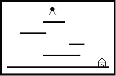

# 第8章 动态规划

## 8.1 数字三角形

总时间限制: 1000ms 内存限制: 10000kB

**[题面]**

```
    7
   3 8
  8 1 0
 2 7 4 4
4 5 2 6 5
```

在上面的数字三角形中寻找一条从顶部到底边的路径，使得路径上所经过的数字之和最大。路径上的每一步都只能往左下或右下走。只需要求出这个最大和即可，不必给出具体路径。

三角形的行数大于1小于等于100，数字为0 - 99

**[输入]**

第一行输入正整数 $$N (1 < N \leq 100)$$ 表示三角形的行数，接下来输入 $$N$$ 行三角形的数据，三角形中的数字均为0到99之间的整数。

**[输出]**

输出最大和。

**[样例输入]**

```
5
7
3 8
8 1 0 
2 7 4 4
4 5 2 6 5
```

**[样例输出]**

```
30
```

**[思路]**

使用二维数组 arr 保存数字三角形。

- arr[i, j] ：表示第i行第j个数字，第一层第一个数字为 arr[0, 0]。
- max_sum(i, j) ：表示从 arr[i, j] 到底边各条路径中最大数字和。

整个问题的解变为求 max_sum(0, 0)。

从 arr[i, j] 出发，下一步只能走 arr[i+1, j] 或 arr[i+1, j+1]，故不难得到如下递归写法：

``` cpp
if(i == N-1)
    max_sum(i,j) = arr[i,j]
else
    max_sum(i,j) = max( max_sum(i+1,j), max_sum(r+i,j+1) ) + arr[i,j]
```

但是上面递归的方法会出现计算超时的情况，如样例的数字三角形（括号中为计算次数）,整个计算过程中会出现大量的重复计算，时间复杂度为 $$O(2^n)$$ ，当N=100时，计算肯定会超时。

```
        7(1)
      3(1) 8(1)
    8(1) 1(2) 0(1)
  2(1) 7(3) 4(3) 4(1)
4(1) 5(4) 2(6) 6(4) 5(1)
```

为解决上述重复计算的问题，可以使用记忆型的递归，每次 max_sum(i, j) 得到一个值时，使用max_sum_arr\[i][k] 记录下来，下次用到其值时直接使用即可，免去重复计算。那么整个算法时间复杂度变为 $$O(n^2)$$ ，因为数字三角形数字总数为 N(N+1)/2 。

分析递归执行过程，可以将递归改为递推形式，递推过程为从底层到顶层，如下（括号内值为从当前位置到达底层的最大和）：

```
         7(30)
      3(23)  8(21)
    8(20) 1(13) 0(10)
  2(7) 7(12) 4(10) 4(10)
4(4) 5(5)  2(2)  6(6)  5(5)
```

**[参考代码]**

- 普通递归代码（运行超时）

``` cpp
#include <iostream>
#include <algorithm>
using namespace std;
int N, arr[110][110];

int max_sum(int i, int j) {
    if(i == N-1)
        return arr[i][j];
    else
        return max( max_sum(i+1, j), max_sum(i+1, j+1) ) + arr[i][j];
}

int main(void) {
    cin >> N;
    for(int i=0; i<N; ++i)
        for(int j=0; j<=i; ++j)
            cin >> arr[i][j];
    cout << max_sum(0, 0) << endl;
    return 0;
}
```

- 记忆型递归代码

``` cpp
#include <iostream>
#include <algorithm>
#include <string.h>
using namespace std;

int N, arr[110][110];
int max_sum_arr[110][110];

int max_sum(int i, int j) {
    if(i == N-1)
        return arr[i][j];
    else {
        int max1, max2;
        if(max_sum_arr[i+1][j] != -1)
            max1 = max_sum_arr[i+1][j];
        else 
            max1 = max_sum(i+1, j);

        if(max_sum_arr[i+1][j+1] != -1)
            max2 = max_sum_arr[i+1][j+1];
        else
            max2 = max_sum(i+1, j+1);

        max_sum_arr[i][j] = max(max1, max2) + arr[i][j];
        return max_sum_arr[i][j];
    }
}

int main(void) {
    memset(max_sum_arr, -1, sizeof(max_sum_arr));
    cin >> N;
    for(int i=0; i<N; ++i)
        for(int j=0; j<=i; ++j)
            cin >> arr[i][j];
    cout << max_sum(0, 0) << endl;
    return 0;
}
```

- 从底层往顶层递推的代码

``` cpp
#include <iostream>
#include <algorithm>
using namespace std;

int N, arr[110][110];

int main(void) {
    cin >> N;
    for(int i=0; i<N; ++i)
        for(int j=0; j<=i; ++j)
            cin >> arr[i][j];
   
    for(int i=N-2; i>=0; --i)
        for(int j=0; j<=i; ++j)
            arr[i][j] += max( arr[i+1][j], arr[i+1][j+1] );

    cout << arr[0][0] << endl;

    return 0;
}
```

- 使用滚动数组从顶层往底层递推的代码

``` cpp
#include <iostream>
#include <algorithm>
#include <climits>
using namespace std;

int N;
int arr[2][110];

int main(void) {
    int ans = INT_MIN, num;
    cin >> N;
    for(int i=0; i<N; ++i) {
        for(int j=0; j<i+1; ++j) {
            cin >> num;
            arr[i&1][j] = num;
            if(j>0) arr[i&1][j] = max(arr[i-1&1][j-1] + num, arr[i&1][j]);
            if(j<i) arr[i&1][j] = max(arr[i-1&1][j] + num, arr[i&1][j]);
        }
    }
    for(int i=0; i<N; ++i) 
        ans = max(ans, arr[N-1&1][i]);
    cout << ans << endl;

    return 0;
}
```

## 8.2 最长上升子序列

总时间限制: 2000ms 内存限制: 65536kB

**[题面]**

一个数的序列 $$b_i$$，当 $$b_1 < b_2 < ... < b_S$$ 的时候，我们称这个序列是上升的。对于给定的一个序列 $$(a_1, a_2, ..., a_N)$$，我们可以得到一些上升的子序列 $$(a_{i_1}, a_{i_2}, ..., a_{i_K})$$，这里 $$1 \leq i_1 < i_2 < ... < i_K \leq N$$。比如，对于序列 $$(1, 7, 3, 5, 9, 4, 8)$$ ，有它的一些上升子序列，如 $$(1, 7)$$，$$(3, 4, 8)$$等等。这些子序列中最长的长度是4，比如子序列 $$(1, 3, 5, 8)$$。

你的任务就是对于给定的序列，求出最长上升子序列的长度。

**[输入]**

输入的第一行是序列的长度 $$N (1 \leq N \leq 1000)$$。第二行给出序列中的 $$N$$ 个整数，这些整数的取值范围都在0到10000。

**[输出]**

最长上升子序列的长度。

**[样例输入]**

```
7
1 7 3 5 9 4 8
```

**[样例输出]**

```
4
```

**[思路]**

“求序列的前n个元素的最长上升子序列的长度”是个子问题，但这样分解子问题，不具有“无后效性”。

假设 $$f(n) = x$$，但可能有多个序列满足 $$f(n) = x$$。有的序列的最后一个元素比 $$a_{n+1}$$ 小，则加上 $$a_{n+1}$$ 就能形成更长上升子序列；有的序列最后一个元素不比 $$a_{n+1}$$ 小，以后的事情受如何达到状态 $$n$$ 的影响，不符合“无后效性”。

- 确定子问题

“求以$$a_k(k=1, 2, 3…N)$$ 为终点的最长上升子序列的长度”，一个上升子序列中最右边的那个数，称为该子序列的“终点”。

虽然这个子问题和原问题形式上并不完全一样，但是只要这 $$N$$ 个子问题都解决了，那么这 $$N$$ 个子问题的解中，最大的那个就是整个问题的解。

- 确定状态

  - $$f(i)$$ : 以i位置为终点的子序列中，最长上升子序列的长度。

- 状态转移

  - $$f(1) = 1$$
  - $$f(i) = max ( f(j) : 1 \leq j < i \; 且 \; a_j < a_i \; 且 \; k \neq 1) + 1$$，当没有满足要求的j存在时 $$= 1$$。

**[参考代码]**

``` cpp
#include <iostream>
#include <algorithm>
using namespace std;

int N, arr[1100], f[1100];

int main(void) {
    cin >> N;
    for(int i=0; i<N; ++i) 
        cin >> arr[i];

    f[0] = 1;
    for(int i=1; i<N; ++i) {
        f[i] = 1;
        for(int j=0; j<i; ++j)
            if(arr[j] < arr[i])
                f[i] = max(f[i], f[j]+1);
    }

    int ans = f[0];
    for(int i=1; i<N; ++i)
        ans = max(ans, f[i]);
    cout << ans << endl;

    return 0;
}
```


## 8.3 最大公共子序列

总时间限制: 1000ms 内存限制: 65536kB

**[题面]**

我们称序列 $$ Z = \; < z_1, z_2, ..., z_k >$$是序列 $$X = \; < x_1, x_2, ..., x_m >$$ 的子序列，当且仅当存在严格上升的序列 $$< i_1, i_2, ..., i_k >$$，使得对 $$j = 1, 2, ... ,k$$ , 有 $$x_{i_j} = z_j$$。比如 $$Z = \; < a, b, f, c >$$ 是 $$X = \; < a, b, c, f, b, c >$$ 的子序列。

现在给出两个序列 $$X$$ 和 $$Y$$，你的任务是找到 $$X$$ 和 $$Y$$ 的最大公共子序列，也就是说要找到一个最长的序列 $$Z$$，使得 $$Z$$ 既是 $$X$$ 的子序列也是 $$Y$$ 的子序列。

**[输入]**

输入包括多组测试数据。每组数据包括一行，给出两个长度不超过200的字符串，表示两个序列。两个字符串之间由若干个空格隔开。

**[输出]**

对每组输入数据，输出一行，给出两个序列的最大公共子序列的长度。

**[样例输入]**

```
abcfbc         abfcab
programming    contest 
abcd           mnp
```

**[样例输出]**

```
4
2
0
```

**[思路]**

- 确定状态

  - $$f(i, j)$$ : 表示串1的左边i个字符形成的子串，与串2的左边j个字符形成的子串的最长公共子序列的长度。（i，j从0开始）
- 状态转移
  - $$f(n, 0) = 0 \; (n=0 ... len(s1))$$
  - $$f(0, n) = 0 \; (n=0 ... len(s2))$$
  - $$f(i, j) = \begin{cases} f(i-1, j-1) + 1 & \text{s1[i-1]==s2[j-1]} \\ max(f(i, j-1), f(i-1, j)) & \text{other} \end{cases}$$

**[参考代码]**

``` cpp
#include <iostream>
#include <algorithm>
#include <string.h>
using namespace std;

char s1[210], s2[210];
int f[210][210] = {0};

int main(void) {
    while(cin >> s1 >> s2) {
        int len1 = strlen(s1);
        int len2 = strlen(s2);
        for(int i=1; i<=len1; ++i) {
            for(int j=1; j<=len2; ++j)
                if(s1[i-1] == s2[j-1])
                    f[i][j] = f[i-1][j-1] + 1;
                else
                    f[i][j] = max(f[i][j-1], f[i-1][j]);
        }
        cout << f[len1][len2] << endl;
    }

    return 0;
}
```

## 8.4 最佳加法表达式

总时间限制: 1000ms 内存限制: 65536kB

**[题面]**

给定 $$n$$ 个1到9的数字，要求在数字之间摆放 $$m$$ 个加号（加号两边必须有数字），使得所得到的加法表达式的值最小，并输出该值。例如，在1234中摆放1个加号，最好的摆法就是12+34,和为36。

**[输入]**

有不超过15组数据， 每组数据两行。

第一行是整数$$m$$，表示有$$m$$个加号要放$$( 0 \leq m \leq 50)$$。

第二行是若干个数字。数字总数 $$n$$ 不超过50，且 $$m \leq n-1$$。

**[输出]**

对每组数据，输出最小加法表达式的值。

**[样例输入]**

```
2
123456
1
123456
4
12345
```

**[样例输出]**

```
102
579
15
```

**[思路]**

假定数字串长度是n，添完加号后，表达式的最后一个加号添加在第i个数字后面，那么整个表达式的最小值，就等于在前i个数字中插入m – 1个加号所能形成的最小值，加上第i + 1到第n个数字所组成的数的值（i从1开始算）。

- 确定状态

  - $$f(m, n)$$ : 表示在n个数字中插入m个加号所能形成的表达式的最小值。

- 状态转移

  - $$f(m, n) = \begin{cases} n个数字构成的整数 & m=0 \\ \infty & n<m+1 \\ min(f(m-1, i), num(i+1, n)) & other \end{cases}$$
  - $$num(i, j)​$$ : 表示从第i个数字到第j个数字所组成的数，数字编号从1开始。

本题数值比较大，需要使用高精度计算。

**[参考代码]**

- 使用字符串模拟大数运算

``` cpp
#include <iostream>
#include <string>
#include <algorithm>
using namespace std;

#define LEN 55

string add(string, string);
int cmp(string, string);

int m;
string str;
// f[i][j] 表示j个数中插入i个加号形成的表达式最小值
string f[LEN][LEN];
// num[i][j] 表示从第i个数字到第j个数字组成的数
string num[LEN][LEN];

int main(void) {
    string max_s(55, '9');

    while(cin >> m >> str) {
        int n = str.length();

        // 求解对应的num[i][j]
        for(int i=1; i<=n; ++i)
            for(int j=i; j<=n; ++j)
                num[i][j] = str.substr(i-1,j-i+1);
        
        // 当加号数目为0时
        for(int i=1; i<=n; ++i)
            f[0][i] = num[1][i];
        for(int i=1; i<=m; ++i) {
            for(int j=1; j<=n; ++j) {
                string min_s = max_s;
                for(int k=i; k<=j; ++k) {
                    string sum = add(f[i-1][k], num[k+1][j]);
                    if(cmp(min_s, sum) > 0)
                        min_s = sum;
                }
                f[i][j] = min_s;
            }
        }
        cout << f[m][n] << endl;
    }

    return 0;
}

string add(string num1, string num2) {
	if(num1.length() < num2.length()) {
		string temp = num1;
		num1 = num2;
		num2 = temp;
	}
	for(int i=num1.length()-1, j=num2.length()-1; i>=0; --i,--j) {
		num1[i] = char(num1[i]+(j>=0?num2[j]-'0':0));
		if(num1[i]-'0' >= 10) {
			num1[i] = char((num1[i]-'0')%10+'0');
			if(i) num1[i-1]++;
			else  num1='1'+num1;
		}
	}
	return num1;
}


int cmp(string num1, string num2) {
    int l1 = num1.length();
    int l2 = num2.length();
    if(l1 != l2)
        return l1 - l2;
    else
        for(int i=0; i<l1-1; ++i)
            if(num1[i]!=num2[i])
                return num1[i] - num2[i];
    return 0;
}
```

- 通过大数类运算符重载实现大数运算

``` cpp
#include <iostream>
#include <string>
#include <cstring>
#include <algorithm>
using namespace std;

#define LEN 55

struct BigInt {
    int num[110];
    int len;

    BigInt() {
        len = 1;
        memset(num, 0, sizeof(num));
    }
	
    BigInt(const char * n) {
        memset(num, 0, sizeof(num));
        len = strlen(n);
        for(int i=0; n[i]; ++i)
            num[len-i-1] = n[i] - '0';
    }

    BigInt(const char c, int L) {
        memset(num, 0, sizeof(num));
        len = L;
        for(int i=0; i<L; ++i)
            num[i] = c-'0';
    }

    BigInt operator+ (const BigInt & n) {
        int ml = max(len,n.len);
        int carry = 0; // 进位 
        BigInt result;
        for(int i=0; i<ml; ++i) {
            result.num[i] = num[i] + n.num[i] + carry;
            if(result.num[i] >= 10) {
                carry = 1;
                result.num[i] -= 10;
            }
            else carry = 0;
        }
        if(carry == 1) {
            result.len = ml + 1;
            result.num[ml] = 1; 
        }
        else result.len = ml;
        return result;
    }
    
    friend bool operator < (const BigInt & n1, const BigInt & n2);
};

bool operator < (const BigInt & n1, const BigInt & n2) {
    if(n1.len > n2.len) return false;
    else if(n1.len < n2.len) return true;
    else {
        for(int i=n1.len-1; i>=0; --i) {
            if(n1.num[i] < n2.num[i])
                return true;
            else if(n1.num[i] > n2.num[i])
                return false;
        }
        return false;
    }
}

ostream & operator << (ostream & o,const BigInt & n) {
    for(int i = n.len - 1;i >= 0; --i)
        o << n.num[i];
    return o;
}

int m;
string str;
// f[i][j] 表示j个数中插入i个加号形成的表达式最小值
BigInt f[LEN][LEN];
// num[i][j] 表示从第i个数字到第j个数字组成的数
BigInt num[LEN][LEN];

int main(void) {
    BigInt max_n('9', 55);

    while(cin >> m >> str) {
        int n = str.length();

        // 求解对应的num[i][j]
        for(int i=1; i<=n; ++i)
            for(int j=i; j<=n; ++j)
                num[i][j] = BigInt(str.substr(i-1,j-i+1).c_str());
        
        // 当加号数目为0时
        for(int i=1; i<=n; ++i)
            f[0][i] = num[1][i];
        for(int i=1; i<=m; ++i) {
            for(int j=1; j<=n; ++j) {
                f[i][j] = max_n;
                for(int k=i; k<=j; ++k)
                    f[i][j] = min(f[i][j], f[i-1][k] + num[k+1][j]);
            }
        }
        cout << f[m][n] << endl;
    }

    return 0;
}
```

## 8.5 Help Jimmy

总时间限制: 1000ms 内存限制: 65536kB

**[题面]**

"Help Jimmy" 是在下图所示的场景上完成的游戏：

<div  style="width:400px; margin:0 auto;"></div>


场景中包括多个长度和高度各不相同的平台。地面是最低的平台，高度为零，长度无限。

Jimmy老鼠在时刻0从高于所有平台的某处开始下落，它的下落速度始终为1米/秒。当Jimmy落到某个平台上时，游戏者选择让它向左还是向右跑，它跑动的速度也是1米/秒。当Jimmy跑到平台的边缘时，开始继续下落。Jimmy每次下落的高度不能超过MAX米，不然就会摔死，游戏也会结束。 

设计一个程序，计算Jimmy到底地面时可能的最早时间。 

**[输入]**

第一行是测试数据的组数$$t(0 \leq t \leq 20)$$。

每组测试数据的第一行是四个整数$$N$$，$$X$$，$$Y$$，$$MAX$$，用空格分隔。$$N$$是平台的数目（不包括地面），$$X$$和$$Y$$是Jimmy开始下落的位置的横竖坐标，$$MAX$$是一次下落的最大高度。接下来的$$N$$行每行描述一个平台，包括三个整数，$$X1[i]$$，$$X2[i]$$和$$H[i]$$。$$H[i]$$表示平台的高度，$$X1[i]$$和$$X2[i]$$表示平台左右端点的横坐标。$$1 \leq N \leq 1000$$，$$-20000 \leq X, X1[i], X2[i] \leq 20000$$，$$0 < H[i] < Y \leq 20000$$ $$(i = 1..N)$$。所有坐标的单位都是米。 

Jimmy的大小和平台的厚度均忽略不计。如果Jimmy恰好落在某个平台的边缘，被视为落在平台上。所有的平台均不重叠或相连。测试数据保证问题一定有解。 

**[输出]**

对输入的每组测试数据，输出一个整数，Jimmy到底地面时可能的最早时间。

**[样例输入]**

```
1
3 8 17 20
0 10 8
0 10 13
4 14 3
```

**[样例输出]**

```
23
```

**[思路]**

Jimmy跳到一块板上后，可以有两种选择，向左走，或向右走。走到左端和走到右端所需的时间，是很容易算的。如果我们能知道，以左端为起点到达地面的最短时间，和以右端为起点到达地面的最短时间，那么向左走还是向右走，就很容选择了。

因此，整个问题就被分解成两个子问题，即Jimmy所在位置下方第一块板左端为起点到地面的最短时间，和右端为起点到地面的最短时间。这两个子问题在形式上和原问题是完全一致的。将板子从上到下从1开始进行无重复的编号（越高的板子编号越小，高度相同的几块板子，哪块编号在前无所谓），那么，和上面两个子问题相关的变量就只有板子的编号。

不妨认为Jimmy开始的位置是一个编号为0，长度为0的板子，本题就变为求0号板子到达地面的最短时间。


- 确定状态

  - $$f(i, 0)$$ : 表示从i号板子左端到地面的最短时间。
  - $$f(i, 1)$$ : 表示从i号板子右端到地面的最短时间。

- 状态转移

  - $$f(i, 0) = \begin{cases} H[i]-H[j]+min(f(j, 0) + X1[i] - X1[j], f(j, 1) + X2[j] - X1[i]) & \text{(1)} \\ \infty & \text{(2)} \\ H[i] & \text{(3)} \end{cases}$$
  - (1) : 板子i左端下方存在板子j，且 高度差小于 MAX
  - (2) : 高度差大于 MAX
  - (3) : 板子i左端下方不存在板子

根据上面左端到达地面最短时间状态转移方程不难推出右端到达地面最短时间的状态转移方程，整个问题的解只需求出 $$f(0,0)$$ 或 $$f(0, 1)$$ 即可。

**[参考代码]**

``` cpp
#include <iostream>
#include <algorithm>
using namespace std;

const int NUM_MAX = 100000;
const int LEN = 1010;

struct Board { 
    int lx, rx, h;
    bool operator < (const Board & b) const {
        return h > b.h;
    }
} boards[LEN];

int f[LEN][2];
int T, N, X, Y, MAX;

int get_min(int i, int x) {
    Board cur = boards[i];
    int j;
    for(j=i+1; j<N+1 && cur.h-boards[j].h<=MAX; ++j) 
        if(boards[j].lx <= x && boards[j].rx >= x)
            return cur.h - boards[j].h + min(f[j][0]+x-boards[j].lx, f[j][1]+boards[j].rx-x);

    if(cur.h - boards[j].h > MAX) 
        return NUM_MAX;
    else
        return cur.h;
}

int main(void) {
    cin >> T;
    for(int i=0; i<T; ++i) {
        cin >> N >> X >> Y >> MAX;
        
        boards[0].lx = boards[0].rx = X; 
        boards[0].h = Y; 

        for(int j=1; j<N+1; ++j)
            cin >> boards[j].lx >> boards[j].rx >> boards[j].h;
        sort(boards, boards+N+1);

        for(int j=N; j>=0; --j) {
            f[j][0] = get_min(j, boards[j].lx);
            f[j][1] = get_min(j, boards[j].rx);
        }
        cout << f[0][0] << endl;
    }
    return 0;
}
```
